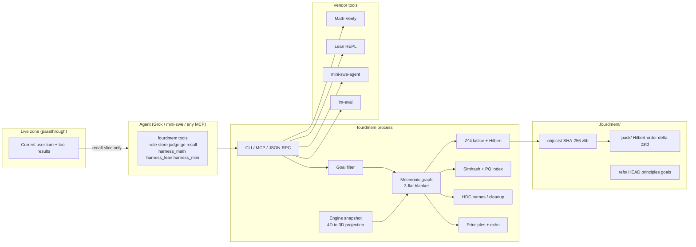
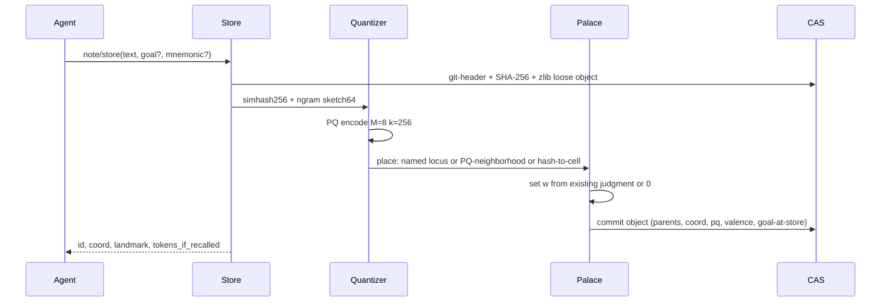

# 4D Memory Harness

| Field | Value |
| --- | --- |
| Title | 4D Memory Harness (working name: `4d-memory`) |
| Author | Cole / Grok design loop |
| Date | 2026-09-06 |
| Status | Draft |
| Repo | `C:\Users\coled\Projects\4d-memory` |
| Package / CLI | `fourdmem` |

---

## Overview

Context rot is the failure mode of long AI sessions: as the prompt fills, the model degrades, forgets, and recalls the wrong things. This project is not a vector database and not a game title. It is a **harness** the agent uses whenever — to store memories, write notes, jot things down, and actually recall — the way a human uses a notebook plus a method-of-loci palace.

The mechanism is concrete. Incoming context is **quantized** (content-addressed, product-quantized, lattice-snapped) into objects that live on a **4-dimensional integer lattice**. The fourth axis is **valence** (good ↔ bad). The first three axes are a mnemonic palace the agent walks. A tiny custom engine shows a **3D projection of that 4D store**. Navigation *is* recall: the agent moves among named landmarks, and the live prompt receives only a small high-signal slice. Everything else stays in the 4D store and is retrieved by moving through it, never by rewriting conversation history.

v1 implements 4D fully: lattice, Hilbert keys, lossless git-family object store, mnemonic movement, goal-conditioned pertinence filter, valence judgment, a running 3D engine, and the already-downloaded math/coding harnesses wired as first-class tools. Dimensions 5, 6, and 7 are specified as real extra lattice axes (time, principle-alignment, echo/becoming), not slogans.

---

## Background & Motivation

### Current state of this repo

The product tree is empty except for vendor harnesses and a project venv:

- Repo root: `C:\Users\coled\Projects\4d-memory` — no `pyproject.toml`, no `src/`, not yet a git repository.
- Venv: `C:\Users\coled\Projects\4d-memory\.venv` — CPython 3.12.11 (uv-managed at `C:\Users\coled\AppData\Roaming\uv\python\cpython-3.12.11-windows-x86_64-none`).
- Installed and verified:
  - `math-verify 0.9.0` (HuggingFace), `latex2sympy2-extended 1.11.0`, `sympy 1.14.0`, `numpy 2.5.3`
  - `mini-swe-agent 2.4.6` (editable from `vendor\coding\mini-swe-agent\src`)
  - `tiktoken 0.14.0` (token budgets)
  - stdlib `zlib` 1.3.1
- **Not** installed (we will add or implement): `zstandard`, FAISS, pygame.
- Math clones: `vendor\math\Math-Verify`, `vendor\math\lm-evaluation-harness` (`lm_eval` 0.4.14.dev0 in the clone), `vendor\math\lean-repl`.
- Lean: elan 4.2.4 at `C:\Users\coled\scoop\persist\elan\.elan`; default toolchain **Lean 4.33.1** / **Lake 5.0.0** (`commit 819816b`). The vendor REPL's `lean-toolchain` file pins `leanprover/lean4:v4.34.0-rc2` (also present at `C:\Users\coled\.elan\toolchains\leanprover--lean4---v4.34.0-rc2`). Project policy: pin **4.33.1** and override the REPL toolchain in our wrapper.

### Pain this product exists to kill

1. **Context rot.** Dumping more history into the prompt does not produce better memory. It produces worse recall and higher cost.
2. **Wrong compression model (Headroom).** The local clone at `C:\Users\coled\Projects\headroom` taught a hard negative lesson: treating compression as “drop old messages from the prefix” (`IntelligentContextManager`, `DropByScoreStrategy`, `frozen_message_count: 0`) busts provider prompt caches and destroys the hot zone. The correct model, documented in `headroom\REALIGNMENT\00-overview.md`, is **passthrough is sacred; offload to a side channel; retrieve on demand**. This harness is that side channel.
3. **kNN-as-UX.** Embedding nearest-neighbor is a fine *internal index*. It is a terrible primary interface for an agent that needs to *know where it put something*. Humans do not recall by cosine; they walk a palace.
4. **No judgment, no goal.** A store that cannot mark good vs bad, and cannot drop (from the *injected slice*, not from disk) what is not pertinent to the current goal, will keep “I saw cats” forever in the prompt.

### What already exists that we will use, not reimplement

These are first-class tools the agent uses **while building this repo** and **while the memory system runs**. They are not optional eval toys.

| Harness | Path / install | What the agent actually calls |
| --- | --- | --- |
| HuggingFace Math-Verify 0.9.0 | clone `vendor\math\Math-Verify`; venv package `math_verify` | `from math_verify import parse, verify` (`parser.py:649`, `grader.py:755`) |
| EleutherAI lm-evaluation-harness | clone `vendor\math\lm-evaluation-harness` | `lm_eval.simple_evaluate(...)` / `lm-eval run` (`docs\python-api.md`) |
| Lean 4 community REPL | clone `vendor\math\lean-repl`; `lake exe repl` JSON stdin/stdout | `{"cmd": "..."}` / `{"tactic": "...", "proofState": n}` (`REPL\Main.lean`, `REPL\JSON.lean`) |
| mini-swe-agent v2.4.6 | clone `vendor\coding\mini-swe-agent`; editable in venv | `DefaultAgent.run(task)` (`agents\default.py`); bash-only loop, linear history |

Math-Verify note for Windows: `parse()` uses a multiprocessing timeout (`parsing_timeout=5`). A one-shot `python -c` spawn can raise `WinError 6` on handle duplication. The harness wrapper **must** run Math-Verify in-process with `parsing_timeout=0` on Windows, or in a durable worker process, never as a throwaway `-c`.

---

## Goals & Non-Goals

### Goals (v1, testable)

1. Agent can `note`, `store`, `judge` (good/bad), `navigate` (mnemonic move), `recall` (goal-pertinent slices only).
2. Injected context token budget is **bounded and measured** (`tiktoken` `cl100k_base`, default 512, hard cap 1024).
3. Non-pertinent distractors (the cats example) **do not appear in recall**.
4. Round-trip: store text → quantized 4D object → 3D locus → navigate → original bytes via content-addressable retrieve (lossless).
5. At least one 4D-index invariant is machine-checked with Lean and/or sympy/Math-Verify (Hilbert encode/decode bijection on a finite 4D grid; projection identity).
6. Vendor harnesses are invokable as tools/scripts in this repo (PR-1).
7. Running engine: headless always, optional window; **no lighting**, almost nothing decorative, movement nearly instant.
8. Paths are stored as memory. Principles persist in a real data model. Language (notes, names, mnemonics) is a first-class object type.
9. Compression is the git family: content-addressable objects, delta, packfiles, zlib/zstd.

### Non-goals (v1)

- A pretty game, Unity/Godot/Unreal title, lighting, physics, NPCs, sound.
- Replacing the conversation prefix with a summary (Headroom ICM). We **offload**, we do not mutate history.
- Being a general vector DB / RAG product. kNN is an internal accelerator.
- Training or hosting an embedding model. v1 descriptors are simhash + hashed n-grams + optional later embeddings as a *descriptor slot*, not as the palace.
- Bit-compatible git packfiles (we copy the *family* of algorithms, not `git fsck` compatibility). Hash is SHA-256, not SHA-1.
- Quaternions as 4D rotations (they rotate 3D). 4D uses Givens / even Clifford rotors.
- Hyperdimensional computing as the spatial model (10k-D is not a palace). VSA is a language-binding layer only.
- Implementing dimensions 5–7 as running axes. v1 ships the 4D lattice and the typed extension points.
- Mutating vendor trees except via our wrappers / a pinned `lean-toolchain` override.

---

## Key Decisions

These are binding for v1. Changing one is a design revision, not a drive-by.

| # | Decision | Rationale |
| --- | --- | --- |
| K1 | **4th axis `w` is valence (good/bad), quantized to \(\mathbb{Z}\) in \([-8,+8]\).** Goal pertinence is **not** an axis. | The operator asked for both “4D so it judges good or bad” and “every prompt has a goal.” A spatial axis must be a stable property of an object. Goals change every prompt; putting goal on an axis would re-embed the palace every turn and destroy loci. Valence is a judgment attached to the object: nearby on `w` means similarly judged, so “recall the good stuff related to this” is a walk toward \(+w\) in the same \((x,y,z)\) neighborhood. Pertinence is a **query-time gate**. |
| K2 | **Winner spatial model: \(\mathbb{Z}^4\) lattice + n-D Hilbert keys (Skilling) + axis-aligned 3-flat blanket + perspective 4D→3D projection.** | Implementable, invertible, locality-preserving, and actually four-dimensional. Morton is shipped as a debug alternative. Geometric algebra rotors (Givens in 6 planes) rotate the blanket later; v1 navigation is axis-aligned. |
| K3 | **Winner object layer: git-family CAS (SHA-256, git-style headers, zlib loose objects, Hilbert-ordered pack + copy/insert delta + zstd).** | Lossless reconstruction is a v1 success bar. This is the same compression family GitHub actually uses. Quantization is for *indexing and placement*, not for destroying bytes. |
| K4 | **Winner “quantize context”: 256-bit simhash + 64-byte hashed n-gram sketch, then product quantization (M=8, k=256) in numpy. No FAISS dependency in v1.** | FAISS is not in the venv. PQ is a real algorithm (Jégou 2011) we can implement in ~200 lines of numpy. OPQ identity rotation until 10k objects. kNN over PQ codes is **internal only**. |
| K5 | **Primary UX is method-of-loci movement, not kNN.** Named landmarks, `go`/`step`/`follow`/`ascend`/`descend`. | Operator constraint. kNN may propose a locus at store time; the agent recalls by walking. |
| K6 | **Live prompt is a passthrough. The palace is a side channel.** Recall injects only as a tool result (or a bounded live-zone tail block), never by rewriting system prompt or old turns. Tools are **always registered**. | Headroom `REALIGNMENT\00-overview.md`: dropping/summarizing prefix busts caches; flipping tools on/off busts the tools array. CCR is the right *idea* (hash-addressed retrieve); this palace is the persistent CCR for *memory*, not for tool-output crushing. |
| K7 | **Tiny custom engine, not Unity/Godot.** Headless JSON snapshot is the source of truth. Optional wireframe window (boxes + labels, no lighting, instant teleports). | This is a retrieval engine. A game engine would eat the project. |
| K8 | **VSA/HDC earns a narrow keep: language binding, not space.** D=8192 bipolar; bind names to loci; bundle room occupants; cleanup memory for landmark lookup. | Operator: language is first-class. HD vectors are not a 4D palace. |
| K9 | **Principles are a real object type plus an echo loop, not mysticism.** The system is the organization of itself: principles persist; the store reorganizes; the agent is not a person. | Encoded as `principle` objects, `echo_count`, batched `reorganize`. |
| K10 | **Pin Lean 4.33.1 / Lake 5.0.0** via `ELAN_HOME=C:\Users\coled\scoop\persist\elan\.elan` and a project `lean-toolchain`. Override vendor REPL’s 4.34.0-rc2 pin in the wrapper. | Matches the installed default toolchain. Avoid mixed proof environments. |
| K11 | **Python package `fourdmem`, Python 3.12, uv.** Engine and store in Python for v1; hot loops (Hilbert, PQ scan) in numpy. No Rust rewrite in v1. | Empty repo, venv already Python. Speed targets below are hit in numpy at 10k–100k objects. |
| K12 | **Default recall 512 tokens, hard cap 1024, measured with `tiktoken` `cl100k_base`.** Exceeding cap truncates by pertinence rank, never silently overruns. | Product outcome is saving the context window. If we cannot measure, we did not ship. |

---

## Proposed Design

### 1. System shape



The conversation prefix (system prompt, tools array, old turns) is **never rewritten**. The agent calls tools. Tool results land in the live zone. That is how memory enters the model.

### 2. The 4D mathematical model (the winner)

#### 2.1 Lattice

Let a memory occupy a point on the integer lattice

\[
L_4 = \mathbb{Z}^4 \cap \bigl([0,X)\times[0,Y)\times[0,Z)\times[-W,W]\bigr)
\]

v1 defaults: \(X=16\), \(Y=16\), \(Z=8\), \(W=8\).

That is \(16\times16\times8\times17 = 34{,}816\) cells. Multiple objects may share a cell. The palace is a **view** over the object store, not 1:1 with objects.

Coordinates:

| Axis | Name | Meaning | Range | Who writes it |
| --- | --- | --- | --- | --- |
| \(x\) | east | palace floor plan | \([0,16)\) | mnemonic assignment or Hilbert-folded PQ neighborhood |
| \(y\) | north | palace floor plan | \([0,16)\) | same |
| \(z\) | up | floors / stories | \([0,8)\) | same |
| \(w\) | valence | bad \(\rightarrow\) good | \([-8,+8]\) | `judge` (default 0) |

A point is `Coord4 = tuple[int, int, int, int]` with the invariant

```python
def in_bounds(c: Coord4) -> bool:
    x, y, z, w = c
    return 0 <= x < 16 and 0 <= y < 16 and 0 <= z < 8 and -8 <= w <= 8
```

Chebyshev distance on the lattice:

\[
d_\infty(p,q) = \max_i |p_i - q_i|
\]

Neighborhood of radius \(r\) (v1 recall neighborhood \(r=1\) on \((x,y,z)\), \(r_w=1\) on \(w\) unless `prefer_good`/`prefer_bad` expands toward a pole).

#### 2.2 The blanket (3-flat in 4D)

The running engine never renders \(\mathbb{R}^4\). It renders a **blanket**: an affine 3-flat

\[
B_{n,c} = \{ p \in \mathbb{R}^4 : n \cdot p = c \},\qquad \|n\|=1.
\]

v1: \(n = (0,0,0,1)\), \(c = w_{\text{agent}}\). The agent walks the 3D palace at a fixed valence slice. Objects with \(|w - c| > 0\) are *off-slice*; the snapshot may mention them as “above/below in valence” but does not inject their text until the agent `ascend`/`descend`s or `recall` includes them via the goal filter.

Extension (not v1 navigation, API exists): rotate \(n\) in one of the six 4D planes with a Givens rotation \(R_{ij}(\theta)\), \(\theta \in \{k\pi/8\}\). That tilts the blanket. Quaternions are **not** used for this (they act on \(\mathbb{R}^3\)).

#### 2.3 4D → 3D projection

Given camera distance \(d > W\) (v1 \(d = 16\)) looking along \(w\):

\[
(x',y',z') = \frac{d}{d - w}\,(x,y,z)
\]

On an axis-aligned slice \(w=c\) this is a uniform scale, so the palace geometry is undistorted and invertibility is immediate: \((x,y,z) = \frac{d-c}{d}(x',y',z')\).

When the blanket is tilted, project by dropping the coordinate along \(n\) after rotating \(n\) onto \(e_w\) with Givens.

**Invariant (Math-Verify / sympy):** the scale identity \(\frac{d}{d-w}\cdot\frac{d-w}{d} = 1\) for all \(w \neq d\). The harness will `parse`/`verify` the closed form; the Python projector is tested against sympy’s exact Rational arithmetic.

#### 2.4 Hilbert and Morton keys

Every occupied cell has a locality-preserving 1D key used as the packfile order and as a B-tree key.

**Default: n-dimensional Hilbert curve, Skilling 2004** (“Programming the Hilbert curve”), \(n=4\), \(b=4\) bits per spatial axis and a signed map for \(w\): store \(w' = w + W\) so \(w' \in [0,16)\), then encode \((x,y,z,w')\) with 4 bits each → 16-bit Hilbert index (fits in `uint32`, leaving headroom for dim 5+).

```text
hilbert_encode_4d(x, y, z, w, bits=4) -> int
hilbert_decode_4d(h, bits=4) -> (x, y, z, w)
```

**Morton (Z-order)** is the debug/fallback coder: bit interleave of the four axes. Worse locality, trivial invertibility, useful as a differential test.

**Lean invariant (v1 success bar):** in `lean/FourDMem/Hilbert.lean`, for `bits = 4`:

```lean
theorem hilbert_encode_decode_id
    (p : Fin 16 × Fin 16 × Fin 16 × Fin 16) :
    decode (encode p) = p := by sorry -- replace with proof or `#eval` exhaustive check
```

Because \(16^4 = 65536\), exhaustive `#eval` over the grid is a legitimate machine check in the REPL (seconds, not hours). We also prove invertibility of the bit-interleave Morton coder by `native_decide` / `rfl` on the bit operations. The Hilbert proof may start as exhaustive REPL evaluation plus a Lean wrapper theorem; a closed-form proof is welcome but not a v1 blocker if exhaustive check is wired through `fourdmem harness lean`.

**Python property tests:** 10k random points, `decode(encode(p))=p`, `encode(decode(h))=h`; locality: for Chebyshev-1 neighbors, Hilbert distance is bounded in distribution (histogram logged, not a hard theorem).

#### 2.5 Why this composition, not the other candidates

| Candidate | Role in the winner | Why not the whole product |
| --- | --- | --- |
| Product quantization / OPQ / RQ | Internal descriptor compression + kNN placement hints | Not a palace; not 4D; not lossless |
| Git CAS + pack/delta/zstd | Lossless object layer | Not spatial, not judgment, not navigation |
| 4D Hilbert / Morton | Pack order + spatial keys | Not a UX; not language |
| Method of loci | Primary navigation graph | Needs a real 4D backing store |
| HDC / VSA | Name↔locus bind, room bundle, cleanup | 10k-D, not navigable |
| Geometric algebra / tesseract projection | 4D→3D view + future blanket tilt | Not a store |
| Goal-conditioned retrieval | Query-time gate | Ephemeral; cannot be the 4th axis |
| Valence as 4th coordinate | **The 4th axis** | Needs the other layers to be usable |

The winner is the **composition**, with Hilbert+lattice+blanket as the spatial core, git-CAS as the lossless core, loci as the UX, PQ as the index, goal-filter as the prompt shield, VSA as the naming layer.

### 3. Quantizing context

“Quantize context” is a pipeline, not an embedding call.



Steps:

1. **Atomic notes.** Split on blank lines / tool-result boundaries. Do not split inside fenced code. Each atom is one `blob`.
2. **Canonical bytes.** UTF-8, LF newlines, no trailing spaces on lines, final newline. This is the lossless payload.
3. **Git-style header + hash.**
   ```
   payload = f"{type} {len(data)}\0".encode() + data
   oid = sha256(payload)
   ```
   Loose path: `.fourdmem/objects/{oid[:2]}/{oid[2:]}` zlib level 6.
4. **Simhash (256-bit).** Tokenize on `\w+`; each token hashed with SHA-256; weighted feature bits summed; sign → 256-bit Charikar fingerprint. Hamming distance is the lexical metric.
5. **N-gram sketch (64 bytes).** 3-grams of lowercase letters hashed into 64 bytes (count-min, 1 row).
6. **Product quantization.** Concatenate simhash-as-32-uint8 + sketch → 96-byte vector (or 96 floats). Split into \(M=8\) subvectors of 12 bytes. Each subspace: k-means \(k=256\) on a training reservoir (first 10k objects, then frozen until `fourdmem quant train`). Code = 8 bytes. Identity OPQ rotation \(R=I\) until an explicit train. Residual quantization is a v2 flag, not v1 default.
7. **Placement.**
   - If the agent passed `mnemonic="library"`, occupy that landmark’s \((x,y,z)\); \(w\) from judgment.
   - Else find up to 8 PQ-nearest existing objects; majority-vote their cell; if empty enough, take it; else spiral in Hilbert order.
   - Else `hash-to-cell`: `oid[0]%X, oid[1]%Y, oid[2]%Z`.
8. **Language object.** If the atom is a name or mnemonic, also bind VSA vectors (section 8).

Quantization **never replaces** the blob. Recall of the original is always `cas.get(oid)`.

### 4. Goal-conditioned pertinence (the cats rule)

Every prompt has a **goal**. The goal is an object (`type=goal`) and also the current `refs/goal`.

```text
pertinence(goal, mem) =
    0.40 * jaccard(tokens(goal.text), tokens(mem.text))
  + 0.25 * (1 - hamming(goal.pq, mem.pq) / M)
  + 0.20 * 1 / (1 + graph_dist(agent.pos, mem.locus))   # 3D palace graph
  + 0.15 * vsa_score(goal.bind, mem.bind)               # [-1,1] mapped to [0,1]
```

Recall **includes** `mem` iff:

- `pertinence >= τ` (default `τ = 0.35`), **or**
- `mem` lies on the current stored path, **or**
- the agent explicitly `look`s at a cell (still truncated by token cap, but `look` is local),

**and not** if:

- `mem` is tagged `not_pertinent` for this goal, or
- `goal.exclude` terms match and pertinence `< 0.50`.

**Cats example (v1 acceptance test).** Goal: `"prove Hilbert 4D encode/decode is bijective"`. Stored memories: the Hilbert note (pertinent) and `"I saw cats on screen"` (not pertinent). `recall` must return the Hilbert note and must not contain the string `cats` (case-insensitive). The cats blob **remains in CAS**. `fourdmem cas show <oid>` still reconstructs it. We offload; we do not delete.

Valence modulates *which neighborhood* is walked, not whether cats pass the gate:

- `query_mode=prefer_good`: search \((x,y,z)\) neighbors at \(w \in [w_{\text{agent}}, +W]\).
- `query_mode=prefer_bad`: toward \(-W\) (failure memories).
- `query_mode=neutral` (default): \(w \in [w_{\text{agent}}-1, w_{\text{agent}}+1]\).

Judgment without a goal still moves \(w\). Goal without judgment still filters. They compose; they are not the same axis.

### 5. Method of loci and movement grammar

The 3D palace is a grid graph of **rooms** (cells) with optional **landmarks** (named rooms) and **paths** (stored walks).

```text
Room
  coord3: (x,y,z)
  landmark: Optional[str]      # unique in the palace
  occupants: list[oid]         # all w; snapshot filters
  exits: {n,s,e,w,up,down}     # missing at bounds
  stairs_w: {ascend, descend}  # change valence, stay in (x,y,z)
```

Movement is **nearly instant**: no interpolation, no physics. Teleport to a landmark is a dict lookup.

**Grammar (agent-facing, one command per call):**

| Command | Effect |
| --- | --- |
| `go <landmark>` | Teleport to named locus; record path edge |
| `step <n\|s\|e\|w\|up\|down>` | One cell; error at bounds |
| `ascend` / `descend` | \(w \leftarrow w\pm 1\), clamped |
| `slice w=<int>` | Set blanket \(c\) |
| `follow <path>` | Replay a stored path, snapshot at the end |
| `look` | Describe current cell + r=0 occupants (goal-filtered), ≤256 tokens |
| `recall [radius=1]` | Neighborhood slice, ≤512 tokens, goal-filtered |
| `mark <name>` | Set landmark on current cell |
| `note <text>` | Store blob at current locus, \(w\) unchanged |
| `store <text> [mnemonic=]` | Store and optionally place at a landmark |
| `judge <oid\|here> <good\|bad\|[-1,1]> [reason]` | Write `judgment`, move \(w\) |
| `path save <name>` | Commit the current uncommitted walk as a `path` object |

**Paths are memory.** A `path` object stores the sequence of `Coord4`, the goal-at-walk, and timestamps. Recurring walks with the same landmark sequence increment `echo_count` on that path. `follow` is recall by route.

The engine snapshot after every move is the tool result. The agent does not need a window.

### 6. Tiny engine (3D projection of 4D)

Process: `fourdmem engine [--window]`. Headless is default.

- Protocol: JSON-RPC over TCP `127.0.0.1:4747` (Windows-friendly; also `--stdio`).
- State: current `Coord4`, blanket \((n,c)\), last snapshot.
- Snapshot schema (always returned, also printed as ASCII for CLI):

```json
{
  "coord": {"x": 3, "y": 5, "z": 1, "w": 2},
  "landmark": "library",
  "slice": "w=2",
  "visible": [
    {"cell": [3,5,1], "label": "library", "oids": ["ab..."], "titles": ["Hilbert bijection"]}
  ],
  "off_slice": [{"cell": [3,5,1], "w": -2, "hint": "bad: failed Lean proof"}],
  "exits": ["n", "e", "ascend", "descend"],
  "tokens_if_recall": 180
}
```

**Window mode (optional, later PR):** immediate-mode wire cubes, one color per valence band, text labels, no lighting, no textures, no shadows. Click = `go`. This is explicitly not a product surface; the agent uses snapshots.

Tick model: **event-driven**. No 60 fps loop unless a window is open. Headless move is a function call.

### 7. Git-family object store

#### 7.1 Object types

```text
blob        canonical note bytes
tree        a room: sorted list of (name, oid, coord4)
commit      a store event: tree, parents, goal, valence, timestamp, agent
principle   statement, weight, evidence oids, echo_count
path        sequence of Coord4, landmark names, goal-at-walk
mnemonic    landmark name, coord3, vsa vector id
goal        text, exclude terms, τ override, query_mode
judgment    target oid, valence in [-1,1], quantized w, reason, timestamp
lang        first-class language: kind in {note, name, mnemonic, principle_statement}
```

Header: `{type} {size}\0` + canonical JSON (sorted keys, UTF-8, no insignificant whitespace) except `blob` which is raw bytes.

#### 7.2 On-disk layout

```text
.fourdmem/
  HEAD                    # current Coord4 + oid of last commit
  config.toml             # lattice bounds, τ, token caps, toolchain paths
  objects/ab/cd..         # loose zlib
  pack/
    pack-{sha}.pack
    pack-{sha}.idx
  refs/
    principles            # oid of current principle bundle
    goal                  # current goal oid
    paths/{name}
    mnemonics/{name}
  index/
    hilbert.idx           # hkey -> [oid]
    pq.idx                # 8-byte codes + oid (memory-mapped)
    names.fts             # sqlite FTS5 for language objects (stdlib+sqlite3)
  palace/
    loci.json             # graph (regenerable from trees; cached)
  logs/
    events.jsonl
```

Store root: `{cwd}/.fourdmem` (project-scoped, like Headroom’s `{cwd}/.headroom/memory.db`). Override `--store`.

#### 7.3 Pack / delta / zstd

`fourdmem gc`:

1. List all oids, look up Hilbert keys (unplaced objects sort last).
2. Sort by Hilbert key (locality → similar bytes nearby → better deltas).
3. For each object, try copy/insert delta against the previous 4 objects in this order (git window=4 analogue). Keep delta if `len(delta) < 0.8 * len(zlib(full))`.
4. Write pack: magic `4DM1`, version 1, count; per object: type nibble + size varint + encoding (`full-zlib` | `full-zstd` | `ref-delta-zstd`); then payload.
5. Write idx: 256-byte fanout on first hash byte, then sorted oids, CRC32C, offsets.
6. Delete loose objects that are in a pack.

v1 adds `zstandard` to the venv. zlib remains for loose objects (git-like, no extra dep on the write path).

**Round-trip invariant:** `cas.get(oid) == original_bytes` for loose and packed, full and delta.

### 8. Language as a first-class object + VSA

A `lang` object is stored in CAS like any other. Additionally:

- **Names** are unique in a palace (`refs/mnemonics/{name}`).
- **HDC:** D=8192, bipolar \(\{\pm 1\}\), seed from `blake2b(name)`.
  - Bind: componentwise multiply. `name ⊙ locus_vec`.
  - Bundle: signed sum + sign. A room is the bundle of its occupant binds.
  - Cleanup: item memory (dict name → vector); probe by cosine; winner if cosine ≥ 0.15.
- `go <name>` uses cleanup if the string is not an exact landmark (typos, paraphrases). Exact match wins first.

This is the only role VSA plays. It does not define coordinates.

### 9. Principles and the echo loop

Philosophical constraint, encoded as data, not as a persona:

> The system is the organization of itself. Echo/becoming is the learning loop. Principles persist. The store reorganizes. The agent is not pretending to be a person.

```python
class Principle(BaseModel):
    oid: str
    statement: str
    mnemonic: str | None
    weight: float                 # [0, 1]
    evidence: list[str]           # oids
    echo_count: int
    created_at: datetime
    reinforced_at: datetime
```

`refs/principles` points at a `tree` of principle oids (a bundle). The VSA bundle of principle statements is the “identity” vector of the store.

**Echo loop** (`fourdmem reorganize`, also auto every 64 `store`/`judge` events):

1. Cluster occupants by PQ code + \(w\) band.
2. If a cluster has ≥3 judgments with the same sign, mint or reinforce a principle from the majority reason texts (the *agent* writes the statement via a required `--statement` or a stored template; v1 does **not** call an LLM inside `reorganize` — no hidden model).
3. Optionally emit a summary `blob` whose parents are the cluster oids (git-commit analogue). Originals stay.
4. Unnamed occupants may move at most 1 Chebyshev step toward the cluster’s median cell. **Landmarks never move.**
5. Increment `echo_count` on touched principles and paths.
6. Append an event to `logs/events.jsonl`. Never touch conversation history.

Dimension 6 (later) *reads* principle-alignment as a coordinate. v1 only stores the field that will become that coordinate (`principle_score` on each commit, computed as Jaccard against the principle bundle, cached).

### 10. Dimensions 5 / 6 / 7 (explicit extension points)

v1 code must use `LatticeND` with `n=4` default. Hilbert, Morton, pack order, and `Coord` are parameterized by `n`.

| Dim | Axis | Mathematical object | Navigation verb | When it becomes live |
| --- | --- | --- | --- | --- |
| 4 | \(w\) valence | signed integer, lattice coord | `ascend`/`descend`/`judge` | **v1** |
| 5 | \(t\) epoch | \(t = \lfloor \log_2(1 + now - created)\rfloor\) or discrete session index, extra Hilbert dim | `earlier`/`later` | v2 |
| 6 | \(p\) principle-alignment | \(p = \mathrm{quantize}(\mathrm{sim}(obj, P_t))\) where \(P_t\) is the current principle bundle; **derived**, recomputed on echo | `align` | v3 |
| 7 | \(e\) echo/becoming | \(e = \mathrm{echo\_count}\) (or log), centrality of the object in the store’s own organization | `become` | v4 |

Hilbert-n (Skilling) already takes `n`. Pack sort key becomes n-D Hilbert. The engine **always** projects a 3-flat: extra axes are selected by `slice` (`fourdmem slice t=3` in 5D, etc.). The blanket formula \(n\cdot p = c\) is dimension-agnostic: in 5D the blanket is still a 3-flat (two constraints), so v2 must pick which two axes are constrained (default: \(w=c_w\), \(t=c_t\)).

Do not invent a “7D metaphor.” If an axis cannot be written as a coordinate plus a Hilbert extension plus a slice rule, it does not ship.

### 11. Attaching the harness to an agent

Three equivalent surfaces, one core (`fourdmem.api.Store`).

#### 11.1 CLI (works with mini-swe-agent bash loop)

```text
fourdmem note "..."
fourdmem store "..." --mnemonic library
fourdmem judge here good --reason "Lean proof passed"
fourdmem go library
fourdmem step n
fourdmem recall --goal "prove Hilbert bijection"
fourdmem look
fourdmem harness math-verify --gold "1/2" --answer "0.5"
fourdmem harness lean --cmd "def f := 2"
fourdmem harness mini-swe --task "..."
```

mini-swe-agent (`DefaultAgent`, `environments/local.py`) executes **one bash command per step** via `subprocess`. CLI is the native attachment for coding work on this repo. Trajectories stay linear (`agents/default.py`).

#### 11.2 MCP (Grok / any MCP client)

Stdio server `fourdmem mcp`. Tools always registered (Headroom lesson: do not flip the tools array):

`note`, `store`, `judge`, `go`, `step`, `follow`, `look`, `recall`, `ascend`, `descend`, `slice`, `mark`, `principle_assert`, `principle_list`, `harness_math_verify`, `harness_lean`, `harness_mini_swe`.

Recall tool result is the only memory injection.

#### 11.3 Live-zone rule (non-negotiable)

```text
ALLOWED
  - append a tool result
  - append a bounded recall block to the *current* user turn if the host has no tools
  - register the full tool list on every request

FORBIDDEN
  - rewrite system prompt with memories
  - drop / summarize / reorder old turns
  - add/remove tools depending on whether recall is empty
  - mutate bytes the provider may have prefix-cached
```

This is the Headroom live-zone / CCR lesson applied to memory: the palace is CCR with spatial keys. `recall` is `ccr_retrieve`. The oid is the hash. The original is always in CAS.

### 12. Vendor harness wiring (implementation-grade)

All under `src/fourdmem/harness/`. PR-1 ships these before palace code.

#### 12.1 Math-Verify

```python
# src/fourdmem/harness/math_verify.py
from math_verify import parse, verify

def math_verify(gold: str, answer: str, *, windows_safe: bool = True) -> dict:
    timeout = 0 if windows_safe else 5
    g = parse(gold, parsing_timeout=timeout)
    a = parse(answer, parsing_timeout=timeout)
    ok = bool(verify(g, a))
    return {"ok": ok, "gold_parsed": str(g), "answer_parsed": str(a)}
```

Used to check projection identities and numeric Hilbert fixtures (e.g. gold `65536` vs computed grid size \(16^4\)).

#### 12.2 Lean REPL

```python
# src/fourdmem/harness/lean_repl.py
# Spawns: ELAN_HOME=C:\Users\coled\scoop\persist\elan\.elan
#         lake exe repl   (cwd = vendor/math/lean-repl with toolchain override)
#
# Protocol (REPL/Main.lean): JSON commands separated by blank lines.
# {"cmd": "def f := 2"} -> {"env": n, "messages": [...], "sorries": [...]}
# {"cmd": "theorem ...", "env": n}
# {"tactic": "rfl", "proofState": n}
```

Project file `lean/lean-toolchain`:

```text
leanprover/lean4:v4.33.1
```

Wrapper writes a one-line override or passes `--toolchain leanprover/lean4:v4.33.1` via elan so we do not build the vendor clone against 4.34.0-rc2 by accident.

v1 Lean payload: `lean/FourDMem/Hilbert.lean` (encode/decode) and `lean/FourDMem/Projection.lean` (`d / (d - w)` inverse).

#### 12.3 mini-swe-agent

```python
# src/fourdmem/harness/mini_swe.py
# Wraps minisweagent.agents.default.DefaultAgent
# + LitellmModel + LocalEnvironment
# config from vendor/coding/mini-swe-agent/src/minisweagent/config/default.yaml
# cwd forced to repo root. Trajectory saved under .fourdmem/logs/mini-swe/
```

This is how coding work on *this* repo is supposed to run: `fourdmem harness mini-swe --task "implement Hilbert encode/decode"`.

#### 12.4 lm-eval

A task yaml under `evals/lm-eval/fourdmem_invariants.yaml` that treats the Python Hilbert/PQ functions as a “model” emitting answers, scored by Math-Verify where the answer is numeric/symbolic, and by exact match otherwise. Wired in a later PR; PR-1 only exposes `fourdmem harness lm-eval --list`.

### 13. Token budget

`src/fourdmem/budget.py` uses `tiktoken.get_encoding("cl100k_base")` (venv has 0.14.0).

| Stream | Default | Hard cap |
| --- | --- | --- |
| `recall` | 512 | 1024 |
| `look` | 256 | 512 |
| engine snapshot | 128 | 256 |

Packing order into the recall slice: current cell titles → path crumbs (landmark names only) → neighbors by pertinence desc → stop before cap. Never include full blobs if a 1-line title + oid exists; the agent `cas show`s if it needs lossless text (second tool call). That is the compression: **the prompt holds names and oids; the palace holds bytes.**

Metrics on every `recall`: `tokens_in`, `tokens_out`, `tokens_budget`, `dropped_non_pertinent`, `dropped_over_budget`.

### 14. Performance and scale targets

| Operation | Target (10k objects, cold disk warm index) |
| --- | --- |
| `store` 2 KB note | < 5 ms |
| `go` landmark | < 1 ms |
| `recall` r=1 | < 20 ms |
| `cas.get` loose | < 2 ms |
| `gc` 10k objects | < 2 s background |
| engine snapshot | < 5 ms |
| Lean Hilbert exhaustive 16^4 | < 60 s (once per CI) |

Storage at 10k × 2 KB: ~20 MB raw, ~10 MB zlib loose, ~3–6 MB packed. Indexes < 1 MB. Trivial on disk.

100k objects is the v1 design ceiling (still in-process numpy PQ scan). Beyond that: mmap the PQ index and add an IVF list — not v1.

### 15. Repository layout (to be created)

```text
C:\Users\coled\Projects\4d-memory\
  pyproject.toml
  README.md
  docs\DESIGN.md                  # this file
  src\fourdmem\
    __init__.py
    cli.py
    api.py                        # Store facade
    budget.py
    store\{cas.py, pack.py, types.py, refs.py}
    quant\{simhash.py, pq.py, hilbert.py, morton.py}
    space\{lattice.py, project.py, givens.py}
    palace\{graph.py, paths.py, engine.py, snapshot.py}
    retrieve\{goal.py, valence.py, recall.py}
    principles\{model.py, echo.py}
    vsa\{hdc.py}
    harness\{math_verify.py, lean_repl.py, mini_swe.py, lm_eval.py}
    agent\{mcp.py, tools.py, live_zone.py}
  lean\lean-toolchain             # leanprover/lean4:v4.33.1
  lean\FourDMem\{Hilbert.lean, Projection.lean, Lakefile}
  evals\{cats_distractor.yaml, roundtrip.yaml, lm-eval\...}
  tests\{test_cas.py, test_hilbert.py, test_cats.py, test_budget.py, test_harness.py, ...}
  vendor\                         # already present; do not modify in feature PRs
```

---

## API / Interface Changes

There is no prior product API. This section is the v1 surface.

### Python

```python
from fourdmem.api import Store

s = Store.open(".fourdmem")          # or Store.open_default()
s.set_goal("prove Hilbert bijection", exclude=["cats"])
oid = s.store("Hilbert encode/decode is a bijection on Fin 16^4", mnemonic="library")
s.judge(oid, +1.0, reason="checked by Lean exhaustive")
s.go("library")
slice_ = s.recall()                  # RecallSlice(text, oids, tokens, dropped)
blob = s.cas.get(oid)                # original bytes
```

### CLI

`fourdmem` Typer app (venv already has `typer` via mini-swe-agent). Subcommands match the movement grammar plus `harness`, `gc`, `engine`, `mcp`, `cas show`.

### MCP tools (JSON Schema sketch)

```json
{
  "name": "recall",
  "description": "Return the goal-pertinent memory slice at the current 4D locus. Does not modify conversation history.",
  "inputSchema": {
    "type": "object",
    "properties": {
      "goal": {"type": "string"},
      "radius": {"type": "integer", "default": 1, "minimum": 0, "maximum": 3},
      "query_mode": {"enum": ["neutral", "prefer_good", "prefer_bad"]}
    }
  }
}
```

```json
{
  "name": "judge",
  "description": "Assign valence (good/bad) to a memory or the current cell. Moves the object on the w axis.",
  "inputSchema": {
    "type": "object",
    "properties": {
      "target": {"type": "string", "description": "oid or 'here'"},
      "valence": {"oneOf": [{"enum": ["good", "bad"]}, {"type": "number", "minimum": -1, "maximum": 1}]},
      "reason": {"type": "string"}
    },
    "required": ["target", "valence"]
  }
}
```

Harness tools take strings and return `{ok, output}` JSON. They never stream model tokens into the palace unless the caller `store`s them.

### Engine RPC

```text
{"jsonrpc":"2.0","id":1,"method":"move","params":{"verb":"go","to":"library"}}
{"jsonrpc":"2.0","id":1,"result":{ /* snapshot */ }}
```

---

## Data Model Changes

Greenfield. Canonical JSON examples:

**commit**

```json
{
  "type": "commit",
  "tree": "sha256...",
  "parents": ["sha256..."],
  "blob": "sha256...",
  "coord": [3, 5, 1, 2],
  "pq": "base64-8-bytes",
  "simhash": "hex-64",
  "goal": "sha256...",
  "valence": 0.75,
  "principle_score": 0.4,
  "echo_count": 0,
  "created_at": "2026-09-06T00:00:00Z"
}
```

**judgment**

```json
{
  "type": "judgment",
  "target": "sha256...",
  "valence": 1.0,
  "w": 8,
  "reason": "Lean exhaustive encode/decode passed",
  "created_at": "2026-09-06T00:00:00Z"
}
```

**path**

```json
{
  "type": "path",
  "name": "library-to-proof-room",
  "coords": [[3,5,1,2],[3,6,1,2],[4,6,1,3]],
  "landmarks": ["library", null, "proof-room"],
  "goal": "sha256...",
  "echo_count": 1
}
```

**principle**

```json
{
  "type": "principle",
  "statement": "Non-pertinent observations are not recalled.",
  "mnemonic": "cats-stay-in-cas",
  "weight": 1.0,
  "evidence": ["sha256..."],
  "echo_count": 3
}
```

### Migration

v1: if `config.toml` lattice bounds change, rebuild Hilbert index (`fourdmem reindex`). Objects do not move unless `reorganize`. No on-disk version yet beyond pack magic `4DM1`. When n-D lands, `config.n` and a new pack magic `4DM2`; old packs remain readable.

---

## Alternatives Considered

### A1. Vector DB as the product (Chroma / FAISS kNN UX)

- **Pros:** fast to ship a demo; familiar RAG.
- **Cons:** operator explicitly rejected this as the primary UX; no palace, no 4D, no judgment axis, no paths-as-memory; becomes generic.
- **Verdict:** reject as UX. Keep PQ kNN as an internal index.

### A2. Goal as the 4th coordinate

- **Pros:** matches a literal reading of “remember what is pertinent.”
- **Cons:** goals are per-prompt; the palace would thrash; landmarks would not stay put; “good vs bad” would have no axis.
- **Verdict:** reject. Goal is a query-time filter. Valence is \(w\).

### A3. Unity / Godot palace

- **Pros:** prettier 3D; Cole has engines locally.
- **Cons:** product is a memory harness; lighting/assets/scene graphs are scope cancer; agent does not need a GPU window; Headless+JSON is the real interface.
- **Verdict:** reject for v1. Optional wireframe window in-process later.

### A4. Drop / summarize old conversation turns (Headroom ICM)

- **Pros:** naive token savings.
- **Cons:** busts prompt cache; irreversible loss; documented as the wrong mental model in `headroom\REALIGNMENT\00-overview.md` (ICM, `DropByScoreStrategy`, `frozen_message_count: 0`).
- **Verdict:** forbidden. Offload to CAS; retrieve via `recall`.

### A5. HDC/VSA as the 4D space

- **Pros:** binding/bundling/cleanup are real; associative memory.
- **Cons:** D≈10^4 is not a navigable 4-manifold; no method of loci; no 3D projection that is 4D math.
- **Verdict:** narrow keep for names only.

### A6. Quaternions for 4D rotation

- **Pros:** well-known.
- **Cons:** unit quaternions parametrize \(\mathrm{SO}(3)\), not \(\mathrm{SO}(4)\). \(\mathrm{SO}(4)\) needs a pair of quaternions or 6 Givens planes.
- **Verdict:** Givens / pair-of-quaternions if we tilt the blanket. Not v1 navigation.

### A7. FAISS OPQ as a required dependency

- **Pros:** battle-tested.
- **Cons:** not in the venv; Windows wheels are painful; v1 scale is 10k–100k, numpy is enough.
- **Verdict:** optional extra later. v1 numpy PQ.

---

## Security & Privacy Considerations

| Threat | Severity | Mitigation |
| --- | --- | --- |
| Store contains secrets from transcripts | High | Project-scoped `.fourdmem/`; never upload; `fourdmem gc --drop oid`; recall filter does not exfiltrate off-goal secrets *by default* but is not an ACL — do not store what should not be on disk |
| MCP/CLI as a confused deputy writing files | Med | Store I/O stays under `.fourdmem/` and `--store`; harness `mini-swe` can write the repo — that is intentional and must be run in a trusted workspace |
| Lean/Math-Verify subprocess DoS | Med | Timeouts; Windows in-process Math-Verify; Lean REPL one worker, queue commands |
| Prompt injection via stored notes | High | Recalled text is untrusted data, wrapped in delimiters (`<memory oid=…>`), never executed; `harness` tools do not auto-store their stdout |
| Tool-list flicker leaking to prefix cache | Med | Tools always registered (K6) |
| Pack/idx bitrot | Low | SHA-256 of objects; idx CRC32C; `fourdmem fsck` |

No network in the core store. Engine binds `127.0.0.1` only. No telemetry in v1.

---

## Observability

**Logs:** `.fourdmem/logs/events.jsonl` — one JSON object per `store|judge|move|recall|reorganize|harness_*`.

Fields: `ts`, `event`, `oid`, `coord`, `goal_oid`, `tokens_in`, `tokens_out`, `tokens_budget`, `dropped_non_pertinent`, `dropped_over_budget`, `latency_ms`.

**Metrics (CLI `fourdmem stat`):** object count, pack ratio, mean recall tokens, cats-style miss rate (eval), Hilbert fsck status.

**Alerts (local):** if `recall` hits hard cap > 50% of calls in a session, print a warning to stderr — the palace is being used as a dump, not as navigation.

**Harness:** Lean/Math-Verify/mini-swe exit codes and stdout captured in the same jsonl.

---

## Rollout Plan

There is no production fleet. Rollout is **repo PRs** plus a local feature flag file `.fourdmem/config.toml`.

```toml
n = 4
token_budget = 512
token_hard_cap = 1024
tau = 0.35
engine_window = false
auto_reorganize_every = 64
query_mode = "neutral"
lean_toolchain = "leanprover/lean4:v4.33.1"
elan_home = "C:\\Users\\coled\\scoop\\persist\\elan\\.elan"
```

**Stages**

1. Harnesses runnable (`fourdmem harness ...`) — PR-1.
2. CAS round-trip — PR-2.
3. Hilbert Lean check green — PR-3.
4. Palace + recall + cats test green — PRs 4–8.
5. Principles + pack gc — PRs 9–11.
6. MCP attached to Grok — PR-12.
7. Flag `engine_window=true` only after headless snapshot tests pass.

**Rollback:** every write is append-only CAS. `refs/HEAD` can point at a previous commit. `fourdmem reset --to <oid>` moves HEAD; objects stay. Disable recall by not calling the tool (passthrough remains valid).

---

## Risks

| Risk | Severity | Mitigation |
| --- | --- | --- |
| LLMs ignore landmarks and dump everything into `note` | High | Token cap + titles/oids in recall; eval that fails if cats leak |
| PQ-without-embeddings is a weak lexical index | Med | Acceptable for v1; named loci are the real retrieval; optional embedding slot later |
| Echo loop moves objects and breaks “I left it in the library” | High | Landmarks are immovable; unnamed objects move at most 1 cell per echo |
| Engine becomes a game project | High | Headless-first; window PR is optional and has a hard “no lighting” spec |
| Lean 4.33 vs vendor 4.34 mismatch | Med | K10 pin; wrapper sets ELAN toolchain |
| Math-Verify Windows multiprocessing | Med | `parsing_timeout=0` in wrapper (observed `WinError 6` on `python -c`) |
| Hilbert locality weaker than expected in 4D at 4 bits | Low | 4 bits is the v1 palace; raise bits without changing API |
| Tokeniser mismatch vs Grok’s real BPE | Med | Pluggable encoding name in config; log char count too |

---

## Open Questions

1. Should `reorganize` ever call the user’s LLM to draft principle statements, or stay agent-authored only? **v1: agent-authored only.** Revisit after echo loop exists.
2. Session-index vs log-time for axis 5. Lean toward discrete session index (stable under clock skew).
3. MCP SDK vs hand-rolled stdio JSON-RPC. Prefer a thin hand-rolled server if adding `mcp` Python package is heavy; otherwise official SDK.
4. Whether to vendor a tiny wireframe renderer at all in v1. Default: no window until headless tests pass.
5. Store encryption at rest. Not v1.

---

## v1 Success Bar (tests that must exist)

| Test | File (planned) | Pass criterion |
| --- | --- | --- |
| Harness smoke | `tests/test_harness.py` | Math-Verify `1/2` vs `0.5` (or exact fraction pair that `verify` accepts); Lean `def f := 2` returns an `env`; mini-swe import `DefaultAgent` |
| CAS round-trip | `tests/test_cas.py` | store text → oid → `cas.get` bytes equal; survives `gc` pack+delta |
| Hilbert bijection | `tests/test_hilbert.py` + Lean | `decode(encode(p))=p` on full 16^4 grid in Python; Lean REPL exhaustive or theorem |
| Projection identity | `tests/test_project.py` + Math-Verify | sympy Rational inverse; `parse`/`verify` on the closed form |
| Cats distractor | `tests/test_cats.py` | `recall` for Hilbert goal does not contain `cats`; does contain Hilbert note; cats oid still in CAS |
| Token budget | `tests/test_budget.py` | 200 stored notes, `recall` tokens ≤ 512 (tiktoken cl100k) |
| Navigation | `tests/test_nav.py` | `go library` → `look` shows the stored note |
| Judge / valence | `tests/test_valence.py` | `judge good` moves \(w\) up; `prefer_good` recall prefers it |
| Live-zone | `tests/test_live_zone.py` | helper refuses to mutate a frozen prefix list; tools list is constant |

---

## References

- HuggingFace Math-Verify 0.9.0 — `C:\Users\coled\Projects\4d-memory\vendor\math\Math-Verify` — `parse` (`src\math_verify\parser.py`), `verify` (`src\math_verify\grader.py`).
- EleutherAI lm-evaluation-harness — `C:\Users\coled\Projects\4d-memory\vendor\math\lm-evaluation-harness` — `lm_eval.simple_evaluate`, `docs\python-api.md`.
- Lean 4 community REPL — `C:\Users\coled\Projects\4d-memory\vendor\math\lean-repl` — `REPL\Main.lean`, `REPL\JSON.lean`; JSON stdin/stdout, blank-line framed.
- Lean 4.33.1 / Lake 5.0.0 — `C:\Users\coled\scoop\persist\elan\.elan\toolchains\leanprover--lean4---v4.33.1`; elan 4.2.4.
- mini-swe-agent 2.4.6 — `C:\Users\coled\Projects\4d-memory\vendor\coding\mini-swe-agent` — `DefaultAgent` (`src\minisweagent\agents\default.py`), `LocalEnvironment` (`environments\local.py`), bash-only, linear history.
- Headroom negative lesson — `C:\Users\coled\Projects\headroom\REALIGNMENT\00-overview.md`, `04-phase-B-live-zone.md`, `wiki\ccr.md`, `wiki\memory.md`. Passthrough is sacred; CCR retrieve-by-hash; do not drop prefix.
- Jégou, Douze, Schmid — Product Quantization for Nearest Neighbor Search, IEEE TPAMI 2011.
- Skilling — Programming the Hilbert curve, AIP Conf. Proc. 707, 2004. (n-dimensional Hilbert.)
- Charikar — Similarity estimation techniques from rounding algorithms (simhash).
- Git pack format — content-addressable objects, zlib loose, windowed delta, pack+idx. We copy the family (SHA-256, `4DM1` magic).
- Kanerva / Plate — Hyperdimensional computing / Holographic Reduced Representations (VSA bind/bundle/cleanup).
- Method of loci — spatial mnemonic palaces as the navigation graph, not as decoration.

---

## PR Plan

Incremental, independently reviewable PRs. PR-1 is mandatory first: wire the already-downloaded harnesses. No palace feature lands before the tools that will check its math and the coding loop that will build it.

### PR-1 — Wire math + coding harnesses as invokable tools

- **Title:** `PR-1: wire Math-Verify, Lean REPL, and mini-swe-agent as fourdmem harness tools`
- **Files/components:** `pyproject.toml`; `src/fourdmem/__init__.py`; `src/fourdmem/cli.py` (Typer skeleton + `harness` subcommands); `src/fourdmem/harness/math_verify.py`; `src/fourdmem/harness/lean_repl.py`; `src/fourdmem/harness/mini_swe.py`; `src/fourdmem/harness/lm_eval.py` (list-only); `lean/lean-toolchain` (`leanprover/lean4:v4.33.1`); `tests/test_harness.py`; `README.md` (how to invoke).
- **Dependencies:** none.
- **Description:** Create the Python package and venv extras (`zstandard`). Wrap `math_verify.parse/verify` with Windows-safe `parsing_timeout=0`. Spawn Lean REPL with `ELAN_HOME=C:\Users\coled\scoop\persist\elan\.elan`, toolchain 4.33.1, JSON blank-line protocol from `vendor\math\lean-repl`. Wrap `minisweagent.agents.default.DefaultAgent` + `LocalEnvironment` with cwd=repo root and trajectory dir. Smoke tests: verify a known identity; `{"cmd":"def f := 2"}` returns `env`; import mini-swe 2.4.6. Do not implement the palace yet.

### PR-2 — Content-addressable store (git-family loose objects)

- **Title:** `PR-2: SHA-256 CAS with git-style headers and zlib loose objects`
- **Files/components:** `src/fourdmem/store/cas.py`; `src/fourdmem/store/types.py`; `src/fourdmem/store/refs.py`; `tests/test_cas.py`.
- **Dependencies:** PR-1 (package layout, tests harness).
- **Description:** Object types `blob|commit|tree|...` as typed dicts. `put`/`get`/`fsck`. On-disk `.fourdmem/objects/ab/cd..`. Canonical JSON for non-blobs. Round-trip test is the gate.

### PR-3 — 4D Hilbert / Morton + Lean invariant

- **Title:** `PR-3: 4D Hilbert and Morton coders with Lean encode/decode check`
- **Files/components:** `src/fourdmem/quant/hilbert.py`; `src/fourdmem/quant/morton.py`; `src/fourdmem/space/lattice.py`; `lean/FourDMem/Hilbert.lean`; `tests/test_hilbert.py`.
- **Dependencies:** PR-1 (Lean wrapper), PR-2 (optional, can land in parallel after PR-1).
- **Description:** Skilling n-D Hilbert, n=4, bits=4, signed \(w\) mapped to \(w+W\). Morton bit-interleave as debug coder. Python exhaustive bijection on \(16^4\). Lean file checked via `fourdmem harness lean`. Lattice bounds from Key Decision K2.

### PR-4 — Simhash + product quantization (numpy)

- **Title:** `PR-4: context quantization — simhash, n-gram sketch, numpy PQ`
- **Files/components:** `src/fourdmem/quant/simhash.py`; `src/fourdmem/quant/pq.py`; `tests/test_pq.py`.
- **Dependencies:** PR-2.
- **Description:** 256-bit Charikar simhash, 64-byte 3-gram sketch, PQ M=8 k=256, identity OPQ. Train on a reservoir. No FAISS. Placement helper: PQ-nearest cell vote.

### PR-5 — Mnemonic palace graph and movement grammar

- **Title:** `PR-5: method-of-loci palace — rooms, landmarks, go/step/follow, paths as memory`
- **Files/components:** `src/fourdmem/palace/graph.py`; `src/fourdmem/palace/paths.py`; `src/fourdmem/api.py` (navigate); CLI verbs `go|step|follow|mark|path`; `tests/test_nav.py`.
- **Dependencies:** PR-2, PR-3.
- **Description:** 16×16×8 grid graph, instant teleports, stored `path` objects, landmarks unique. No renderer yet — tests assert coordinates and occupancy.

### PR-6 — 4D blanket, 3D projection, headless engine

- **Title:** `PR-6: 4D blanket slice, perspective projection, headless engine snapshot`
- **Files/components:** `src/fourdmem/space/project.py`; `src/fourdmem/space/givens.py`; `src/fourdmem/palace/engine.py`; `src/fourdmem/palace/snapshot.py`; `lean/FourDMem/Projection.lean`; `tests/test_project.py`.
- **Dependencies:** PR-3, PR-5.
- **Description:** Axis-aligned 3-flat \(w=c\); projection \(\frac{d}{d-w}(x,y,z)\); JSON-RPC on `127.0.0.1:4747`; ASCII/JSON snapshot. Math-Verify/sympy identity test. Givens helpers present but unused by navigation. **No window, no lighting.**

### PR-7 — Valence axis and `judge`

- **Title:** `PR-7: valence as w — judge good/bad, prefer_good/prefer_bad neighborhoods`
- **Files/components:** `src/fourdmem/retrieve/valence.py`; `judgment` type; CLI `judge|ascend|descend|slice`; `tests/test_valence.py`.
- **Dependencies:** PR-5, PR-6.
- **Description:** Quantize valence \([-1,1]\) onto \(w \in [-8,8]\). `judge` writes a `judgment` object and moves occupancy. Query modes select \(w\) bands. Related good/bad = same \((x,y,z)\) neighborhood at different \(w\).

### PR-8 — Goal filter, `recall`, token budget

- **Title:** `PR-8: goal-conditioned recall with measured token budget (cats test)`
- **Files/components:** `src/fourdmem/retrieve/goal.py`; `src/fourdmem/retrieve/recall.py`; `src/fourdmem/budget.py`; `tests/test_cats.py`; `tests/test_budget.py`; `evals/cats_distractor.yaml`.
- **Dependencies:** PR-4, PR-7.
- **Description:** Pertinence formula from §4. `recall` packs titles+oids under 512 tokens (tiktoken cl100k). Cats distractor is a failing gate if `cats` appears. CAS still holds the distractor. Live-zone helper: recall is a tool result only.

### PR-9 — Principles + echo reorganization

- **Title:** `PR-9: principles layer and echo/becoming loop`
- **Files/components:** `src/fourdmem/principles/model.py`; `src/fourdmem/principles/echo.py`; CLI `principle assert|list`, `reorganize`; `tests/test_echo.py`.
- **Dependencies:** PR-8.
- **Description:** `principle` objects, `refs/principles`, `echo_count`. Batched reorganize: cluster, reinforce, unnamed objects move ≤1 cell, landmarks immovable. No hidden LLM call. Caches `principle_score` for future axis 6.

### PR-10 — VSA language objects (names, mnemonics, cleanup)

- **Title:** `PR-10: first-class language objects with HDC bind/bundle/cleanup`
- **Files/components:** `src/fourdmem/vsa/hdc.py`; `lang` type; `tests/test_vsa.py`.
- **Dependencies:** PR-5.
- **Description:** D=8192 bipolar; bind names to loci; bundle room occupants; cleanup for `go` typos. Does not change coordinates.

### PR-11 — Packfiles, delta compression, zstd gc

- **Title:** `PR-11: Hilbert-ordered packfiles with copy/insert delta and zstd`
- **Files/components:** `src/fourdmem/store/pack.py`; CLI `gc|fsck`; `tests/test_pack.py`.
- **Dependencies:** PR-2, PR-3.
- **Description:** `4DM1` pack magic; Hilbert sort; window-4 REF_DELTA; zstd on packed payloads; zlib remains for loose. Round-trip after gc is the gate.

### PR-12 — MCP server + live-zone agent attachment

- **Title:** `PR-12: MCP stdio server and live-zone attachment rules`
- **Files/components:** `src/fourdmem/agent/mcp.py`; `src/fourdmem/agent/tools.py`; `src/fourdmem/agent/live_zone.py`; `tests/test_live_zone.py`.
- **Dependencies:** PR-8, PR-1 (harness tools exposed on MCP too).
- **Description:** Always-on tool list. Tests that a frozen prefix is not mutated. Grok/MCP and CLI call the same `Store`. Document the Headroom constraint in `README.md`.

### PR-13 — Eval suite: round-trip, cats, Hilbert, lm-eval task

- **Title:** `PR-13: v1 success-bar evals and lm-eval task yaml`
- **Files/components:** `evals/`; `tests/test_roundtrip.py`; `src/fourdmem/harness/lm_eval.py` (run); optional `evals/lm-eval/fourdmem_invariants.yaml`.
- **Dependencies:** PR-8, PR-3, PR-11.
- **Description:** One command `fourdmem eval v1` runs cats, budget, CAS-after-pack, Lean Hilbert, projection verify. This is the merge bar for “v1 works.”

### PR-14 — Optional wireframe window (no lighting)

- **Title:** `PR-14 (optional): immediate-mode wireframe window for the 3D projection`
- **Files/components:** `src/fourdmem/palace/window.py` (or skip).
- **Dependencies:** PR-6.
- **Description:** Only if headless snapshots are already used in daily work. Boxes, labels, instant teleports, no lighting. Easy to reject.

PRs 3/4/10 and 11 can parallelize after their dependencies. Feature work on the palace should be implemented *through* mini-swe-agent (`fourdmem harness mini-swe`) once PR-1 lands — that is the point of wiring the coding harness first.
