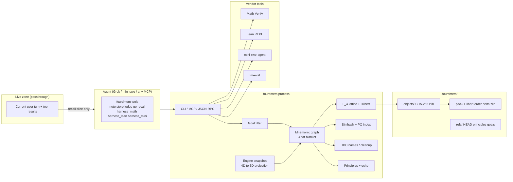
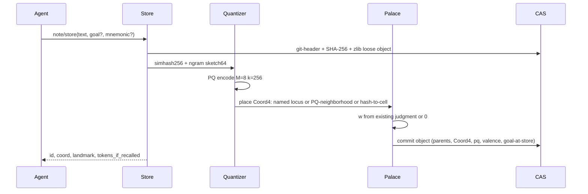

# 4D Memory Harness

| Field | Value |
| --- | --- |
| Title | 4D Memory Harness (working name: `4d-memory`) |
| Author | Cole / Grok design loop |
| Date | 2026-09-06 |
| Status | Draft |
| Repo | https://github.com/born-lucky/4d-memory (`C:\Users\coled\Projects\4d-memory`) |
| Package / CLI | `fourdmem` (argparse; `fourdmem.cli:main`) |

---

## Overview

Context rot is the failure mode of long AI sessions: as the prompt fills, the model degrades, forgets, and recalls the wrong things. This project is not a vector database and not a game title. It is a **harness** the agent uses whenever — to store memories, write notes, jot things down, and actually recall — the way a human uses a notebook plus a method-of-loci palace.

The mechanism is concrete. Incoming context is **quantized** (content-addressed, product-quantized, lattice-snapped) into objects that live on a **4-dimensional integer lattice**. The fourth axis is **valence** (good ↔ bad). The first three axes are a mnemonic palace the agent walks. A tiny custom engine shows a **3D projection of that 4D store**. Navigation *is* recall: the agent moves among named landmarks, and the live prompt receives only a small high-signal slice. Everything else stays in the 4D store and is retrieved by moving through it, never by rewriting conversation history.

v1 implements 4D fully: lattice, Hilbert keys that actually cover \(w = +8\), lossless git-family object store, mnemonic movement with `Coord4` occupancy, goal-conditioned pertinence filter, valence judgment, a running 3D engine, and the math/coding harnesses as first-class tools. Dimensions 5, 6, and 7 are specified as real extra lattice axes (session epoch, principle-alignment, echo/becoming), not slogans.

---

## Background & Motivation

### Current state of this repo

This **is** a git repository (`main`, remote `https://github.com/born-lucky/4d-memory.git`). The public tree already has a Python package and docs. Palace code is not implemented yet. An engineer following PR-1 must extend this tree, not recreate it.

Tracked today:

| Path | What it is |
| --- | --- |
| `pyproject.toml` | `fourdmem` 0.1.0, hatchling, `requires-python = ">=3.12"`, script `fourdmem = "fourdmem.cli:main"`, `packages = ["src/fourdmem"]` |
| `src/fourdmem/__init__.py` | `__version__ = "0.1.0"` |
| `src/fourdmem/cli.py` | **argparse** stub: `fourdmem` / `fourdmem status` |
| `docs/DESIGN.md`, `docs/MATH.md` | architecture + public math |
| `README.md`, `LICENSE` (MIT), `CONTRIBUTING.md`, `.gitignore` | public repo |
| `scripts/bootstrap-harnesses.ps1` | shallow-clones vendor trees (gitignored) |
| `THIRD_PARTY.md` | Apache/MIT notices for pip + local vendor clones |

Not tracked (and must stay that way): `vendor/`, `.venv/`, `.fourdmem/`.

Local machine (2026-09-06), for implementers — **not** product defaults:

- Venv `C:\Users\coled\Projects\4d-memory\.venv` — CPython 3.12.11 (uv).
- Installed: `math-verify 0.9.0`, `latex2sympy2-extended 1.11.0`, `sympy 1.14.0`, `numpy 2.5.3`, `tiktoken 0.14.0`, `mini-swe-agent 2.4.6` (editable from `vendor\coding\mini-swe-agent\src`). stdlib `zlib` 1.3.1. sqlite 3.49.1 with FTS5.
- **Not** in the venv: `zstandard` (declared in `pyproject.toml` as optional extra `[pack]`, used in PR-11), FAISS, pygame, Typer (Typer 0.27.2 arrives only if mini-swe is installed; **fourdmem does not depend on it**).
- Vendor clones (gitignored, bootstrap locally): `vendor\math\Math-Verify` (Apache-2.0), `vendor\math\lm-evaluation-harness` (MIT + task-dataset caveat), `vendor\math\lean-repl` (Apache-2.0, `lean-toolchain` = `leanprover/lean4:v4.34.0-rc2`), `vendor\coding\mini-swe-agent` (MIT).
- Lean: `elan` / `lean` / `lake` are **not on PATH**. Two elan homes exist on this box: scoop persist `C:\Users\coled\scoop\persist\elan\.elan` (`stable` → Lean **4.33.1** / Lake 5.0.0, commit `819816b`) and `C:\Users\coled\.elan` (Lean **4.34.0-rc2** only). See K10: discover elan; do not hardcode these paths.

### Pain this product exists to kill

1. **Context rot.** Dumping more history into the prompt does not produce better memory. It produces worse recall and higher cost.
2. **Wrong compression model (Headroom).** The local clone at `C:\Users\coled\Projects\headroom` taught a hard negative lesson: treating compression as “drop old messages from the prefix” (`IntelligentContextManager`, `DropByScoreStrategy`, `frozen_message_count: 0`) busts provider prompt caches and destroys the hot zone. The correct model, documented in `headroom\REALIGNMENT\00-overview.md`, is **passthrough is sacred; offload to a side channel; retrieve on demand**. This harness is that side channel.
3. **kNN-as-UX.** Embedding nearest-neighbor is a fine *internal index*. It is a terrible primary interface for an agent that needs to *know where it put something*. Humans do not recall by cosine; they walk a palace.
4. **No judgment, no goal.** A store that cannot mark good vs bad, and cannot drop (from the *injected slice*, not from disk) what is not pertinent to the current goal, will keep “I saw cats” forever in the prompt.

### What already exists that we will use, not reimplement

These are first-class tools the agent uses **while building this repo** and **while the memory system runs**. They are not optional eval toys. Obtain vendor clones with `scripts/bootstrap-harnesses.ps1`. Runtime Python deps come from pip (`math-verify`), not from a force-added `vendor/` tree.

| Harness | Path / install | What the agent actually calls |
| --- | --- | --- |
| HuggingFace Math-Verify 0.9.0 | pip `math-verify`; optional clone `vendor\math\Math-Verify` | `from math_verify import parse, verify` (`parser.py:649`, `grader.py:755`) |
| EleutherAI lm-evaluation-harness | clone `vendor\math\lm-evaluation-harness` | `lm_eval.simple_evaluate(...)` / `lm-eval run` (`docs\python-api.md`) |
| Lean 4 community REPL | clone `vendor\math\lean-repl`; `lake exe repl` JSON stdin/stdout | `{"cmd": "..."}` / `{"tactic": "...", "proofState": n}` (`REPL\Main.lean`, `REPL\JSON.lean`) |
| mini-swe-agent v2.4.6 | extra `[harness]`; optional clone `vendor\coding\mini-swe-agent` | `DefaultAgent` (`agents\default.py`); POSIX-first bash loop; see §12.3 |

Math-Verify note for Windows: `parse()` uses a multiprocessing timeout (`parsing_timeout=5`). A one-shot `python -c` spawn can raise `WinError 6` on handle duplication. The harness wrapper **must** run Math-Verify in-process with `parsing_timeout=0` on Windows, or in a durable worker process, never as a throwaway `-c`. `timeout_seconds <= 0` is a no-op decorator in `math_verify.utils.timeout`.

---

## Goals & Non-Goals

### Goals (v1, testable)

The **v1 success bar** is PRs 1–8 plus PR-13. PRs 9–12 and 14 are real work but not the merge bar for “v1 works.”

1. Agent can `note`, `store`, `judge` (good/bad), `navigate` (mnemonic move), `recall` (goal-pertinent slices only).
2. Injected context token budget is **bounded and measured** (`tiktoken` `cl100k_base`, default 512, hard cap 1024).
3. Non-pertinent distractors (the frozen cats fixture) **do not appear in recall**.
4. Round-trip: store text → quantized 4D object → 3D locus → navigate → original bytes via content-addressable retrieve (lossless).
5. Hilbert encode/decode is bijective on **the same set Python stores**: \(L_4\) / `Lattice4` (34,816 cells). Lean checks that type. Projection invertibility is Python vs sympy `Rational` on a grid. Math-Verify is **harness smoke**, not a 4D-index invariant.
6. Vendor harnesses are invokable as tools/scripts in this repo (PR-1), on top of the existing package.
7. Running engine: headless always, optional window; **no lighting**, almost nothing decorative, movement nearly instant.
8. Paths are stored as memory. Principles persist in a real data model. Language (notes, names, mnemonics) is a first-class object type.
9. Compression is the git family: content-addressable objects, delta, packfiles, zlib; zstd in the pack extra (PR-11).

### Non-goals (v1)

- A pretty game, Unity/Godot/Unreal title, lighting, physics, NPCs, sound.
- Replacing the conversation prefix with a summary (Headroom ICM). We **offload**, we do not mutate history.
- Being a general vector DB / RAG product. kNN is an internal accelerator.
- Training or hosting an embedding model. v1 descriptors are simhash + hashed n-grams + optional later embeddings as a *descriptor slot*, not as the palace.
- Bit-compatible git packfiles, and **using the git binary as the store** (A8). We copy the *family* of algorithms, not `git fsck` compatibility. Hash is SHA-256, not SHA-1.
- Quaternions as 4D rotations (they rotate 3D). 4D uses Givens / even Clifford rotors.
- Hyperdimensional computing as the spatial model (10k-D is not a palace). VSA is a language-binding layer only, and only after PR-10.
- Implementing dimensions 5–7 as running axes. v1 ships the 4D lattice and the typed extension points.
- **Committing `vendor/`.** Binding. CI installs `math-verify` from pip and Lean from elan. Bootstrap is the only way to obtain vendor trees. `git add -f vendor/` is a license incident (Issue 6).
- Mutating vendor trees (do not rewrite `vendor/math/lean-repl/lean-toolchain`).
- Making mini-swe-agent the only allowed implementation path (Windows: `LocalEnvironment` is cmd.exe; see §12.3).
- Typer, pydantic, FAISS, `google-crc32c` as `fourdmem` dependencies.

---

## Key Decisions

These are binding for v1. Changing one is a design revision, not a drive-by.

| # | Decision | Rationale |
| --- | --- | --- |
| K1 | **4th axis `w` is valence (good/bad), quantized to \(\mathbb{Z}\) in \([-8,+8]\).** Goal pertinence is **not** an axis. `query_mode` is a field on the `goal` object (query parameter), not a lattice axis. | A spatial axis must be a stable property of an object. Goals change every prompt; putting goal on an axis would re-embed the palace every turn and destroy loci. Valence is a judgment attached to the object: nearby on `w` means similarly judged, so “recall the good stuff related to this” is a walk toward \(+w\) in the same \((x,y,z)\) neighborhood. Pertinence is a **query-time gate**. |
| K2 | **Winner spatial model: \(L_4\) + equal-width 5-bit Skilling Hilbert (K13) + axis-aligned 3-flat blanket + perspective 4D→3D projection.** Occupancy, pack keys, and snapshots are `Coord4` from PR-5 onward. | Implementable, invertible, locality-preserving, and actually four-dimensional. Morton is the debug 5-bit interleave. Givens rotate the blanket later; v1 navigation is axis-aligned **stairs**, not a 3D store with a sidecar int. |
| K3 | **Winner object layer: git-family CAS (SHA-256, git-style headers, zlib loose objects, Hilbert-ordered pack + copy/insert delta).** zstd is optional extra `[pack]` (PR-11), not a core install requirement for PRs 1–10. Pack CRC is **IEEE CRC-32** (`zlib.crc32`), not CRC32C. | Lossless reconstruction is a v1 success bar. CPython 3.12 has `zlib.crc32`, not Castagnoli. Quantization indexes; it does not destroy bytes. |
| K4 | **Winner “quantize context”: 256-bit simhash + 64-byte hashed n-gram sketch, then product quantization (M=8, k=256) in numpy. No FAISS dependency in v1.** | FAISS is not in the venv. PQ is a real algorithm (Jégou 2011) we can implement in ~200 lines of numpy. OPQ identity rotation until 10k objects. kNN over PQ codes is **internal only**. |
| K5 | **Primary UX is method-of-loci movement, not kNN.** Named landmarks, `go`/`step`/`follow`/`ascend`/`descend`. | Operator constraint. kNN may propose a locus at store time; the agent recalls by walking. |
| K6 | **Live prompt is a passthrough. The palace is a side channel.** Recall injects only as a tool result (or a bounded live-zone tail block), never by rewriting system prompt or old turns. Tools are **always registered**. | Headroom `REALIGNMENT\00-overview.md`: dropping/summarizing prefix busts caches; flipping tools on/off busts the tools array. |
| K7 | **Tiny custom engine, not Unity/Godot.** Headless JSON snapshot is the source of truth. Optional wireframe window (boxes + labels, no lighting, instant teleports). | This is a retrieval engine. A game engine would eat the project. |
| K8 | **VSA/HDC earns a narrow keep: language binding, not space.** D=8192 bipolar; bind names to loci; bundle room occupants; cleanup memory for landmark lookup. **v1 recall does not use VSA** (stub 0, renormalized weights until PR-10). | Operator: language is first-class. HD vectors are not a 4D palace. PR-8 must not be blocked on PR-10. |
| K9 | **Principles are a real object type plus an echo loop, not mysticism.** `reorganize` never mints statements; `principle assert` is a separate verb. | Encoded as `principle` objects, `echo_count`. Auto-reorganize cannot block on an agent-authored sentence. |
| K10 | **Two Lake packages, two recorded toolchains, portable elan discovery.** (1) Vendor REPL: leave `vendor/math/lean-repl/lean-toolchain` as `leanprover/lean4:v4.34.0-rc2`; `lake exe repl` in that cwd. (2) Project proofs: `lean/FourDMem` is a **separate** Lake package with `lean/lean-toolchain` = `leanprover/lean4:v4.33.1`. Never feed 4.33 `.olean` into a 4.34 REPL. Discover elan via `ELAN_HOME`, then `elan` on PATH, then `$HOME/.elan` / `%USERPROFILE%\.elan`, then a last-resort probe of scoop persist **logged, not defaulted in config**. | Compiling 4.34-targeted REPL sources with 4.33.1 is unproven. Lake reads `lean-toolchain` in cwd, not `elan --toolchain`. Machine paths are not Key Decisions. |
| K11 | **Python package `fourdmem` already exists** (hatchling, Python ≥3.12, uv). CLI is **argparse** (`src/fourdmem/cli.py`). Dataclasses, not pydantic. Engine and store in Python; hot loops in numpy. No Rust rewrite in v1. | Do not recreate `pyproject.toml` in PR-1. Typer is a mini-swe transitive, not ours. |
| K12 | **Default recall 512 tokens, hard cap 1024, measured with `tiktoken` `cl100k_base`.** Exceeding cap truncates by pertinence rank, never silently overruns. | Product outcome is saving the context window. |
| K13 | **Hilbert is honest to \(L_4\). One on-disk coder.** Keep \(w \in [-8,+8]\) (17 values). Injection \(\iota(x,y,z,w)=(x,y,z,w+8)\) with \(w+8\in[0,16]\), then **equal-width 5-bit Skilling 2004** on the padded hypercube \([0,32)^4\). Keys are 20 bits in `uint32`. Decode rejects points not in \(L_4\). Lean theorem is on `Lattice4` (34,816 cells), the same set Python encodes. **Do not silently drop \(w=+8\).** Mixed-width \((4,4,3,5)\) is **not** v1 (different map, not the cited paper). | 4-bit \(w'\) cannot hold 16. Skilling is equal bits per axis. Two bijections on \(L_4\) are not the same pack order. |
| K14 | **Every occupant, pack key, and snapshot is `Coord4` from PR-5.** Palace graph edges are 3D + valence stairs; occupancy is never `Coord3`. `max_occupants_per_cell = 16`. Single-writer, no lock in v1. | Stops v1 collapsing to a 3D palace plus a sidecar integer. |

---

## Proposed Design

### 1. System shape



The conversation prefix (system prompt, tools array, old turns) is **never rewritten**. The agent calls tools. Tool results land in the live zone. That is how memory enters the model.

One process owns `.fourdmem/` (**single-writer, no lock in v1**). Concurrent CLI + MCP is undefined.

### 2. The 4D mathematical model (the winner)

#### 2.1 Lattice

Let a memory occupy a point on the integer lattice

\[
L_4 = \mathbb{Z}^4 \cap \bigl([0,X)\times[0,Y)\times[0,Z)\times[-W,W]\bigr)
\]

v1 defaults: \(X=16\), \(Y=16\), \(Z=8\), \(W=8\).

That is \(16\times16\times8\times17 = 34{,}816\) cells. Multiple objects may share a cell, up to `max_occupants_per_cell = 16`. The palace is a **view** over the object store, not 1:1 with objects.

Why this box, not a power-of-two 16×16×16×16 cube: eight floors is a palace story count; 256 rooms per floor is walkable; **17 valence levels exist so both poles \(\pm 1.0\) and zero are representable**. Shrinking \(w\) to 16 values would drop \(w=+8\). Expanding \(z\) to 16 would add unused floors, not fix Hilbert.

Coordinates:

| Axis | Name | Meaning | Range | Who writes it |
| --- | --- | --- | --- | --- |
| \(x\) | east | palace floor plan | \([0,16)\) | mnemonic assignment or Hilbert-folded PQ neighborhood |
| \(y\) | north | palace floor plan | \([0,16)\) | same |
| \(z\) | up | floors / stories | \([0,8)\) | same |
| \(w\) | valence | bad \(\rightarrow\) good | \([-8,+8]\) | `judge` (default 0) |

A point is `Coord4 = tuple[int, int, int, int]`:

```python
Coord4 = tuple[int, int, int, int]  # (x, y, z, w)

def in_bounds(c: Coord4) -> bool:
    x, y, z, w = c
    return 0 <= x < 16 and 0 <= y < 16 and 0 <= z < 8 and -8 <= w <= 8
```

**Valence quantization** (the missing map):

```python
W = 8
# good ≡ +1.0, bad ≡ -1.0  (CLI enums)
def valence_to_w(v: float) -> int:
    return max(-W, min(W, int(round(v * W))))
# +1.0 → +8, -1.0 → -8, 0.0 → 0, 0.5 → 4
```

`+1.0` lands on \(w=+8\), which **is** Hilbert-encodable (K13: \(w'=16\) fits in 5 bits).

Chebyshev distance on the lattice (Manhattan is rejected: a diagonal neighbor is one “look” in a palace):

\[
d_\infty(p,q) = \max_i |p_i - q_i|
\]

Neighborhood of radius \(r\) (v1 recall neighborhood \(r=1\) on \((x,y,z)\), \(r_w=1\) on \(w\) unless `prefer_good`/`prefer_bad` expands toward a pole).

#### 2.2 The blanket (3-flat in 4D)

The running engine never renders \(\mathbb{R}^4\). It renders a **blanket**: an affine 3-flat

\[
B_{n,c} = \{ p \in \mathbb{R}^4 : n \cdot p = c \},\qquad \|n\|=1.
\]

v1: \(n = (0,0,0,1)\), \(c = w_{\text{agent}}\). The agent walks the 3D palace at a fixed valence slice. Objects with \(|w - c| > 0\) are *off-slice*; the snapshot may mention them as “above/below in valence” but does not inject their text until the agent `ascend`/`descend`s or `recall` includes them via the goal filter.

Two objects at the same \((x,y,z)\) and different \(w\) have **different Hilbert keys** and **different blanket membership**. That is a PR-5 test, not a PR-7 afterthought.

Extension (not v1 navigation, API exists): rotate \(n\) in one of the six 4D planes with a Givens rotation \(R_{ij}(\theta)\), \(\theta \in \{k\pi/8\}\). That tilts the blanket. Quaternions are **not** used for this (they act on \(\mathbb{R}^3\)).

#### 2.3 4D → 3D projection

Given camera distance \(d > W\) (v1 \(d = 16\)) looking along \(w\):

\[
(x',y',z') = \frac{d}{d - w}\,(x,y,z)
\]

On an axis-aligned slice \(w=c\) this is a uniform scale, so the palace geometry is undistorted and invertibility is immediate: \((x,y,z) = \frac{d-c}{d}(x',y',z')\).

When the blanket is tilted, project by dropping the coordinate along \(n\) after rotating \(n\) onto \(e_w\) with Givens.

**Engineering test (not a 4D-index invariant):** Python projector vs sympy `Rational` on a grid of \(L_4\) points; round-trip on a slice. The algebraic tautology \(\frac{d}{d-w}\cdot\frac{d-w}{d}=1\) may be used as **Math-Verify harness smoke** only. It does not check the projector.

#### 2.4 Hilbert and Morton keys

Every occupied cell has a locality-preserving 1D key used as the packfile order and as a B-tree key.

**The 4-bit cube cannot hold \(L_4\).** \(w=+8 \Rightarrow w'=16 \notin [0,16)\). v1 does not drop the best memories.

**Injection into the unsigned 5-bit hypercube** \(H = [0,32)^4\):

\[
\iota(x,y,z,w) = (x,\, y,\, z,\, w+8), \qquad w+8 \in [0,16].
\]

\(x\in[0,16)\), \(y\in[0,16)\), \(z\in[0,8)\) sit in the low 4/3 bits of a 5-bit field; unused high bits are zero.

**The on-disk coder (the only one):** n-dimensional Hilbert, Skilling 2004, **equal 5 bits per axis**, \(n=4\). Encode \(\iota(p)\in H\); key is 20 bits, stored in `uint32`. Decode: Skilling-inverse, then if the point is not in \(\iota(L_4)\) (e.g. \(z\ge 8\) or \(w'\ge 17\)) return error. Tests and pack order are on \(L_4\) only; unused cells of \(H\) are never produced by `encode`.

```text
hilbert_encode_4d(x, y, z, w) -> int      # requires in_bounds; Skilling-5(ι(p))
hilbert_decode_4d(h) -> Coord4 | error    # error if not in L_4
```

Mixed-width \((4,4,3,5)\) / compact Hilbert is **not** v1. It is a different algorithm (not Skilling) and a different numeric key. Do not ship two maps. Compact Hilbert may be a later pack-version bump (`4DM2`), not an “equivalent.”

**Morton (Z-order)** is the debug/fallback coder: bit-interleave of the **same** 5-bit padded \(\iota(p)\). Worse locality, trivial invertibility, differential test against Hilbert. Morton keys are also 20-bit, not mixed-width.

**Lean invariant (v1 success bar)** — **the same set Python encodes**, not `Fin 16^4`:

```lean
structure Lattice4 where
  x : Fin 16
  y : Fin 16
  z : Fin 8
  wShifted : Fin 17   -- 0..16; valence w = wShifted.val - 8

def encode : Lattice4 → Nat
def decode : Nat → Option Lattice4

theorem hilbert_encode_decode_id (p : Lattice4) :
    decode (encode p) = some p
```

\(|L_4| = 34{,}816\). **Python exhaustive bijection on all 34,816 points is the engineering gate** (milliseconds). Lean: prove the theorem by `#eval` over `Lattice4` if it finishes inside the CI budget (measure in PR-3; do **not** promise 60s). If `#eval` is too slow, Lean proves Morton invertibility + Hilbert round-trip on a reduced **equal-width** `bits=2` Skilling toy (\([0,4)^4\)), and a lockstep test dumps 256 Python encode values for Lean `#eval`. Closed-form Skilling proof is welcome, not a v1 blocker. Tests must not require a second Hilbert implementation to agree on numeric keys.

**Python property tests:** exhaustive `decode(encode(p))=p` on \(L_4\); `encode(decode(h))=h` for keys that decode; `encode` defined at \(w=+8\) and \(w=-8\); locality histogram for Chebyshev-1 neighbors (logged, not a hard theorem).

### 3. Quantizing context

“Quantize context” is a pipeline, not an embedding call.



Steps:

1. **Atomic notes.** Split on blank lines / tool-result boundaries. Do not split inside fenced code. Each atom is one `blob`.
2. **Canonical bytes.** UTF-8, LF newlines, no trailing spaces on lines, final newline. This is the lossless payload.
3. **Git-style header + hash.**
   ```
   payload = f"{type} {len(data)}\0".encode() + data
   oid = sha256(payload)          # 32 raw bytes; hex for display
   ```
   Loose path: `.fourdmem/objects/{oid_hex[:2]}/{oid_hex[2:]}` zlib level 6.
4. **Simhash (256-bit).** Tokenize on `\w+`; each token hashed with SHA-256; weighted feature bits summed; sign → 256-bit Charikar fingerprint. Hamming distance is the lexical metric.
5. **N-gram sketch (64 bytes).** 3-grams of lowercase letters hashed into 64 bytes (count-min, 1 row).
6. **Product quantization.** Concatenate simhash-as-32-uint8 + sketch → 96-byte vector. Split into \(M=8\) subvectors of 12 bytes. Each subspace: k-means \(k=256\) on a training reservoir (first 10k objects, then frozen until `fourdmem quant train`). Code = 8 bytes. Identity OPQ rotation \(R=I\) until an explicit train. Residual quantization is a v2 flag, not v1 default.
7. **Placement — always a `Coord4`.**
   - If the agent passed `mnemonic="library"`, occupy that landmark’s \((x,y,z)\) and current (or judged) \(w\).
   - Else find up to 8 PQ-nearest existing objects; majority-vote their `Coord4`; if that cell has `< 16` occupants, take it; else walk **forward on the Hilbert curve** (next keys, same \(w\) preferred) until a cell with room.
   - Else `hash_to_cell(digest: bytes) -> Coord4` on the **raw 32-byte SHA-256**, not the hex string:
     ```python
     def hash_to_cell(digest: bytes) -> Coord4:
         return (digest[0] % 16, digest[1] % 16, digest[2] % 8, 0)
     ```
     \(w=0\) until `judge`. Valence is never taken from the hash.
8. **Language object.** If the atom is a name or mnemonic, also bind VSA vectors (section 8) — **after PR-10**. Before that, names are exact-match refs only.

Quantization **never replaces** the blob. Recall of the original is always `cas.get(oid)`.

### 4. Goal-conditioned pertinence (the cats rule)

Every prompt has a **goal**. The goal is an object (`type=goal`) and also the current `refs/goal`. `query_mode` (`neutral|prefer_good|prefer_bad`) lives **on the goal object**. It is not a lattice axis and must not be promoted onto \(w\).

**v1 weights (PR-8, VSA stubbed):**

```text
pertinence(goal, mem) =
    0.47 * jaccard(tokens(goal.text), tokens(mem.text))
  + 0.29 * (1 - hamming(goal.pq, mem.pq) / M)
  + 0.24 * 1 / (1 + graph_dist(agent.pos, mem.locus))   # graph on Coord4
```

These are \(0.40/0.25/0.20\) renormalized over \(0.85\) after dropping the 0.15 VSA term. `vsa_score = 0` until PR-10. After PR-10, restore \(0.40+0.25+0.20+0.15\) and keep the cats fixture green.

**`look` vs `recall` (one rule):** both apply the same \(\tau\) (default \(0.35\)) and the same exclude/`not_pertinent` gates. `look` is the current cell only (radius 0), cap 256 tokens. `recall` is radius 1, cap 512. **Neither bypasses \(\tau\).** Walking into the cats cell and `look`ing *can* surface cats — that is navigation, not a leak. The cats **test** calls `recall` from `library`, not `look` at the distractor.

**Path crumbs, not path occupants:** `recall` may append **path crumbs** (landmark name + oid of each vertex on the current stored path), never every occupant of those cells. Crumbs are titles+oids, still under the token cap.

Recall **includes** `mem` iff:

- `pertinence >= τ`, **or** `mem` is a **path crumb** of the current stored path,

**and not** if:

- `mem` is tagged `not_pertinent` for this goal, or
- `goal.exclude` terms match **and** pertinence `< 0.50`.

The primary cats test **does not set `exclude=["cats"]`**. Exclude-terms get a **second**, separate test.

#### Frozen cats fixture (PR-8 / `tests/test_cats.py`)

| Item | Placement |
| --- | --- |
| Goal text | `prove Hilbert 4D encode/decode is bijective` |
| `goal.exclude` | **empty** |
| Hilbert note blob | `Hilbert encode/decode is a bijection on Lattice4.\n` |
| Hilbert title | `Hilbert bijection` |
| Hilbert `Coord4` | `(3, 5, 1, 0)` landmark `library` |
| Cats blob | `I saw cats on screen.\n` |
| Cats title | `cats on screen` |
| Cats `Coord4` | `(12, 2, 0, 0)` — **no landmark**, not on any stored path |
| Agent spawn | `Coord4 (0, 0, 0, 0)` — default \(w=0\), unjudged |
| Agent procedure | `go library` then `recall` (lands on `(3,5,1,0)`, same cell as Hilbert) |
| Stored path | empty, or only vertices at `library` `(3,5,1,0)` |

**What `recall` returns (bytes):** a UTF-8 block of lines `title <space> oid_hex` plus the **first line of the blob** (not the full blob). Example:

```
Hilbert bijection e3b0c4...
Hilbert encode/decode is a bijection on Lattice4.
```

**Pass criterion:** recall text contains `Hilbert` and the Hilbert oid hex; does **not** contain `cats` (case-insensitive); cats oid is still in CAS (`cas.get` round-trips). Fail if the implementer “fixes” it with `exclude=["cats"]`.

Full blobs are retrieved by `fourdmem cas show <oid>` (second tool call). That is the compression: the prompt holds titles, first lines, and oids.

Valence modulates *which neighborhood* is walked, not whether cats pass the gate:

- `query_mode=prefer_good`: search \((x,y,z)\) neighbors at \(w \in [w_{\text{agent}}, +W]\).
- `query_mode=prefer_bad`: toward \(-W\).
- `query_mode=neutral` (default): \(w \in [w_{\text{agent}}-1, w_{\text{agent}}+1]\).

Judgment without a goal still moves \(w\). Goal without judgment still filters. They compose; they are not the same axis.

### 5. Method of loci and movement grammar

The palace is a grid graph of **rooms**. A room is a `Coord4`. Edges: 6-neighborhood in \((x,y,z)\) at **fixed \(w\)**, plus `ascend`/`descend` changing \(w\) by \(\pm 1\) at fixed \((x,y,z)\).

```text
Room
  coord: Coord4                 # NEVER Coord3
  landmark: Optional[str]       # unique in the palace; names the (x,y,z) column
  occupants: list[oid]          # objects whose Coord4 equals this cell
  exits: {n,s,e,w,up,down}      # missing at bounds; stay at same w
  stairs_w: {ascend, descend}   # change valence
```

A landmark names an \((x,y,z)\) column. `go library` teleports to `(3,5,1,w_agent)` (same \(w\) the agent currently has). **`go` does not snap to an occupant’s \(w\).** Occupants at other \(w\) in that column are off-slice. Default spawn is \(w=0\); the cats/nav Hilbert note is therefore stored at `(3,5,1,0)`, not at \(w=2\). A snapshot example at \(w=2\) is a different scene (agent already `ascend`ed).

Movement is **nearly instant**: no interpolation, no physics. Teleport to a landmark is a dict lookup.

**Grammar (agent-facing, one command per call):**

| Command | Effect |
| --- | --- |
| `go <landmark>` | Teleport to named \((x,y,z)\), keep \(w\); record path edge |
| `step <n\|s\|e\|w\|up\|down>` | One cell in 3D, same \(w\); error at bounds |
| `ascend` / `descend` | \(w \leftarrow w\pm 1\), clamped to \([-8,+8]\) |
| `slice w=<int>` | Set blanket \(c\) |
| `follow <path>` | Replay a stored path, snapshot at the end |
| `look` | Current cell, same \(\tau\) as recall, ≤256 tokens |
| `recall [radius=1]` | Neighborhood slice, ≤512 tokens, goal-filtered |
| `mark <name>` | Set landmark on current \((x,y,z)\) |
| `note <text>` | Store blob at **current `Coord4`** |
| `store <text> [mnemonic=]` | Store and optionally place at a landmark’s \((x,y,z)\), \(w\) current |
| `judge <oid\|here> <good\|bad\|[-1,1]> [reason]` | Write `judgment`, set \(w=\mathrm{clamp}(\mathrm{round}(v W),-W,W)\) |
| `path save <name>` | Commit the current uncommitted walk as a `path` object |

**Paths are memory.** A `path` object stores the sequence of `Coord4`, the goal-at-walk, and timestamps. Recurring walks with the same landmark sequence increment `echo_count` on that path. `follow` is recall by route.

**PR-5 invariant test:** two blobs at `(3,5,1,+2)` and `(3,5,1,-2)` have different Hilbert keys, different blanket membership at \(c=+2\), and both exist as occupants of different rooms.

The engine snapshot after every move is the tool result. The agent does not need a window.

### 6. Tiny engine (3D projection of 4D)

Process: `fourdmem engine [--window] [--port 4747]`. Headless is default.

- Protocol: JSON-RPC over TCP `127.0.0.1`. Default port **4747**. If 4747 is taken and `--port` was not an explicit exclusive bind, try 4748–4757 and print the bound port on stdout. `--port 0` = ephemeral. If `--port 4747` was explicit and taken: exit 2. Localhost only; no auth (v1).
- State: current `Coord4`, blanket \((n,c)\), last snapshot.
- Snapshot schema:

```json
{
  "coord": {"x": 3, "y": 5, "z": 1, "w": 0},
  "landmark": "library",
  "slice": "w=0",
  "visible": [
    {"cell": [3, 5, 1, 0], "label": "library", "oids": ["ab..."], "titles": ["Hilbert bijection"]}
  ],
  "off_slice": [{"cell": [3, 5, 1, 2], "w": 2, "hint": "judged good; ascend to see"}],
  "exits": ["n", "e", "ascend", "descend"],
  "tokens_if_recall": 180
}
```

`cell` is **four** integers. `off_slice` entries are other \(w\) in the same \((x,y,z)\) column.

**Window mode (optional, PR-14):** immediate-mode wire cubes, one color per valence band, text labels, no lighting, no textures, no shadows. Click = `go`. Not a product surface.

Tick model: **event-driven**. No 60 fps loop unless a window is open. Headless move is a function call.

### 7. Git-family object store

#### 7.1 Object types

```text
blob        canonical note bytes
tree        a room: sorted list of (name, oid, Coord4)
commit      a store event: tree, parents, goal, valence, Coord4, timestamp, agent
principle   statement, weight, evidence oids, echo_count
path        sequence of Coord4, landmark names, goal-at-walk
mnemonic    landmark name, coord3 column (x,y,z), vsa vector id (after PR-10)
goal        text, exclude terms, τ override, query_mode
judgment    target oid, valence in [-1,1], quantized w, reason, timestamp
lang        first-class language: kind in {note, name, mnemonic, principle_statement}
```

Types are **dataclasses** (stdlib). No pydantic.

Header: `{type} {size}\0` + canonical JSON (sorted keys, UTF-8, no insignificant whitespace) except `blob` which is raw bytes.

#### 7.2 On-disk layout

```text
.fourdmem/
  HEAD                    # current Coord4 + oid of last commit
  config.toml             # lattice bounds, τ, token caps; no machine-local elan path
  objects/ab/cd..         # loose zlib
  pack/
    pack-{sha}.pack
    pack-{sha}.idx
  refs/
    principles            # oid of current principle bundle
    goal                  # current goal oid
    paths/{name}
    mnemonics/{name}
  index/
    hilbert.idx           # see §7.4
    pq.idx
  palace/
    loci.json             # graph (regenerable from trees; cached)
  logs/
    events.jsonl
```

No `names.fts` in v1. `go` is exact landmark match, then VSA cleanup after PR-10. Store root: `{cwd}/.fourdmem`. Override `--store`.

#### 7.3 Pack / delta / zstd (`4DM1`)

Little-endian. zstd encodings require extra `[pack]` (`zstandard>=0.23`). v1 `gc` without that extra writes `full-zlib` / `ref-delta-zlib` only.

```text
pack-{sha}.pack
  magic[4]     = b"4DM1"
  version      = uint32 1
  count        = uint32
  objects[count]:
    # git-style size/type nibble:
    #   bits[7:4] type: 1=blob 2=tree 3=commit 4=principle
    #                 5=path 6=mnemonic 7=goal 8=judgment 9=lang
    #   bits[3:0] size low nibble; continuation bytes with high-bit like git
    encoding   = uint8  0=full-zlib  1=full-zstd  2=ref-delta-zlib  3=ref-delta-zstd
    if encoding in {2,3}:
      base_oid = 32 bytes SHA-256     # REF_DELTA only; no OFS_DELTA in v1
    payload    = compressed full object or compressed delta

delta (after decompress), git copy/insert:
  source_size  uleb128
  target_size  uleb128
  ops:
    byte==0                invalid
    byte < 0x80            INSERT: next `byte` bytes literal
    byte >= 0x80           COPY: git opcode
      offset/size assembled from following 0–7 bytes exactly as git
      (opcode bits 0x01,0x02,0x04,0x08 → offset; 0x10,0x20,0x40 → size;
       size==0 means 0x10000)
```

**Base selection:** Hilbert-sort objects. For each object, try REF_DELTA against the previous 1..4 objects **of the same type**. Keep the shortest delta if `len(compressed_delta) < 0.8 * len(zlib(full))`.

```text
pack-{sha}.idx
  magic[4]     = b"4DI1"
  version      = uint32 1
  fanout[256]  = uint32 BE cumulative counts by first oid byte (git-like)
  oids         = count × 32 bytes, sorted
  crc32        = count × uint32 BE, zlib.crc32 of that PackedObject’s on-disk bytes
                 (IEEE CRC-32, polynomial 0xEDB88320; NOT CRC32C)
  offsets      = count × uint64 LE
```

**`gc` crash order:** write `pack-{sha}.pack.tmp` + `idx.tmp` → fsync both → rename pack then idx → **then** delete packed loose objects. No “keep last N loose” after a successful rename; tmp+rename is the safety.

#### 7.4 Indexes (rebuilt, never appended)

`fourdmem gc` and `fourdmem reindex` **rebuild** both files from CAS.

```text
hilbert.idx
  magic b"4DH1"
  version uint32 1
  count   uint32
  records sorted by (key, oid):
    key  uint64 LE     # Hilbert key
    oid  32 bytes

pq.idx
  magic b"4DP1"
  version uint32 1
  M uint8              # 8
  k uint16 LE          # 256
  subdim uint8         # 12
  codebook: M * k * 12 raw bytes
  count uint32
  records:
    code 8 bytes
    oid  32 bytes
```

**Round-trip invariant:** `cas.get(oid) == original_bytes` for loose and packed, full and delta.

### 8. Language as a first-class object + VSA

A `lang` object is stored in CAS like any other. Additionally:

- **Names** are unique in a palace (`refs/mnemonics/{name}`).
- **HDC (PR-10):** \(D=8192\), bipolar \(\{\pm 1\}\).
  - `name_vec(name) = bipolar_from_blake2b(b"name:" + name.encode(), D)`
  - `locus_vec(coord: Coord4) = bipolar_from_blake2b(b"locus:" + struct.pack("<4i", *coord), D)` — deterministic from the tuple, not a table of random cell vectors.
  - Bind: componentwise multiply. `name_vec ⊙ locus_vec`.
  - Bundle: signed sum + sign. A room is the bundle of its occupant binds.
  - Cleanup: item memory (dict name → vector); probe by cosine; winner if cosine ≥ 0.15. Random cosine is \(\sim 1/\sqrt{D} \approx 0.011\); 0.15 is a heuristic, tested in PR-10, not a theorem.
- `go <name>` uses cleanup if the string is not an exact landmark. Exact match wins first.

This is the only role VSA plays. It does not define coordinates. It does not participate in pertinence until PR-10 restores the 0.15 term.

### 9. Principles and the echo loop

Philosophical constraint, encoded as data, not as a persona:

> The system is the organization of itself. Echo/becoming is the learning loop. Principles persist. The store reorganizes. The agent is not pretending to be a person.

```python
@dataclass
class Principle:
    oid: str
    statement: str
    mnemonic: str | None
    weight: float                 # [0, 1]
    evidence: list[str]           # oids
    echo_count: int
    created_at: datetime
    reinforced_at: datetime
```

`refs/principles` points at a `tree` of principle oids.

**Split verbs:**

| Verb | When | What it does |
| --- | --- | --- |
| `fourdmem reorganize` | manual, or auto every 64 `store`/`judge` events | cluster; unnamed occupants move ≤1 Chebyshev step toward cluster median; landmarks **never** move; increment `echo_count`; log event. **Does not mint principles.** |
| `fourdmem principle assert --statement "..."` | agent-authored only | mint or reinforce. v1 does **not** call an LLM inside reorganize. |

Dimension 6 (later) *reads* principle-alignment as a coordinate. v1 caches `principle_score` on each commit (Jaccard against the principle bundle).

### 10. Dimensions 5 / 6 / 7 (explicit extension points)

v1 code must use `LatticeND` with `n=4` default. Hilbert, Morton, pack order, and `Coord` are parameterized by `n`.

| Dim | Axis | Mathematical object | Navigation verb | When |
| --- | --- | --- | --- | --- |
| 4 | \(w\) valence | signed integer, lattice coord | `ascend`/`descend`/`judge` | **v1** |
| 5 | \(t\) epoch | **discrete session index** (monotonic integer, stable under clock skew) | `earlier`/`later` | v2 |
| 6 | \(p\) principle-alignment | \(p = \mathrm{quantize}(\mathrm{sim}(obj, P_t))\); **derived**, recomputed on echo | `align` | v3 |
| 7 | \(e\) echo/becoming | \(e = \mathrm{echo\_count}\) (or log) | `become` | v4 |

**Not a v2 default:** \(t = \lfloor\log_2(1+\Delta t)\rfloor\). That is the same class of bug as putting goal on an axis: a derived, time-varying coordinate that would move objects. Session index does not move a landmark when the clock ticks.

Hilbert-n (Skilling) already takes `n`. The engine **always** projects a 3-flat. Extra axes are selected by `slice`. In 5D the blanket is still a 3-flat (two constraints); default \(w=c_w\), \(t=c_t\).

Do not invent a “7D metaphor.” If an axis cannot be written as a coordinate plus a Hilbert extension plus a slice rule, it does not ship.

### 11. Attaching the harness to an agent

Three equivalent surfaces, one core (`fourdmem.api.Store`). CLI is argparse.

#### 11.1 CLI

```text
fourdmem status
fourdmem note "..."
fourdmem store "..." --mnemonic library
fourdmem judge here good --reason "Lean proof passed"
fourdmem go library
fourdmem step n
fourdmem recall --goal "prove Hilbert 4D encode/decode is bijective"
fourdmem look
fourdmem harness math-verify --gold "1/2" --answer "0.5"
fourdmem harness lean --cmd "def f := 2"
fourdmem harness mini-swe --task "..."     # optional; POSIX-first
```

Palace verbs land in PRs 2–8 by extending `src/fourdmem/cli.py`. Do not switch the CLI to Typer.

#### 11.2 MCP (Grok / any MCP client)

Stdio server `fourdmem mcp` (PR-12). Tools always registered:

`note`, `store`, `judge`, `go`, `step`, `follow`, `look`, `recall`, `ascend`, `descend`, `slice`, `mark`, `principle_assert`, `principle_list`, `harness_math_verify`, `harness_lean`, `harness_mini_swe`.

Recall tool result is the only memory injection.

#### 11.3 Live-zone rule (non-negotiable)

```text
ALLOWED
  - append a tool result
  - append a bounded recall block to the *current* user turn if the host has no tools
  - register the full tool list on every request

FORBIDDEN
  - rewrite system prompt with memories
  - drop / summarize / reorder old turns
  - add/remove tools depending on whether recall is empty
  - mutate bytes the provider may have prefix-cached
```

### 12. Vendor harness wiring (implementation-grade)

All under `src/fourdmem/harness/`. PR-1 ships these **on the existing package**.

#### 12.1 Math-Verify

```python
# src/fourdmem/harness/math_verify.py
from math_verify import parse, verify

def math_verify(gold: str, answer: str, *, windows_safe: bool = True) -> dict:
    timeout = 0 if windows_safe else 5
    g = parse(gold, parsing_timeout=timeout)
    a = parse(answer, parsing_timeout=timeout)
    ok = bool(verify(g, a))
    return {"ok": ok, "gold_parsed": str(g), "answer_parsed": str(a)}
```

PR-1 smoke: a pair `verify` accepts (exact fractions, not the tautology). `verify` is non-symmetric; gold first.

#### 12.2 Lean REPL and project proofs (K10)

Two packages. Do not compile the REPL with 4.33.1.

**REPL (PR-1 gate):** cwd = `vendor/math/lean-repl` (after bootstrap). Lake reads **that directory’s** `lean-toolchain` (`v4.34.0-rc2`). Spawn `lake exe repl`. JSON commands separated by blank lines. Smoke: `{"cmd":"def f := 2"}` returns an `env`. Requires elan to have `leanprover/lean4:v4.34.0-rc2` installed (CI recipe in PR-13; locally `elan toolchain install leanprover/lean4:v4.34.0-rc2`).

**Project proofs (PR-3):** `lean/FourDMem` is a separate Lake package. `lean/lean-toolchain` contains `leanprover/lean4:v4.33.1`. `lake build` in `lean/`. Never import those `.olean` files into the 4.34 REPL.

**Discover elan** (`src/fourdmem/harness/elan.py`):

1. `os.environ["ELAN_HOME"]` if set
2. `shutil.which("elan")` / `which("lake")`
3. `Path.home() / ".elan"`
4. last-resort Windows: `%USERPROFILE%\scoop\persist\elan\.elan` if it exists — **log a warning**, do not write it into committed `config.toml`

`elan` is often not on PATH on Windows. Document that in README. Put Cole’s scoop path only in a **gitignored** `.fourdmem/config.toml` example, never in Key Decisions.

#### 12.3 mini-swe-agent (POSIX-first, not the only path)

Vendor `DefaultAgent.run(task)` and `LocalEnvironment` exist as claimed. Config `default.yaml` requires **exactly one bash code block per step**. On Windows, `subprocess.Popen(..., shell=True)` is **cmd.exe**, not bash. The `bash` on PATH here is the WSL stub. Git bash at `C:\Program Files\Git\bin\bash.exe` is not wired.

**PR-1 smoke:** `import minisweagent` (version 2.4.6) and construct `DefaultAgent` with a **fake model** (no API key). Optional: if `FOURDMEM_GIT_BASH` or Git bash is present, force `LocalEnvironment` to that bash.

**Not a CI gate for PRs 2–11:** “implement this feature through mini-swe.” That needs LiteLLM + a key and a POSIX shell. Coding work on this repo uses ordinary pytest + the fourdmem CLI. mini-swe is a harness we *expose*, not the only legal editor.

#### 12.4 lm-eval

PR-1: `fourdmem harness lm-eval --list` if the clone exists, else a skip message. Task yaml runs in PR-13.

### 13. Token budget

`src/fourdmem/budget.py` uses `tiktoken.get_encoding("cl100k_base")`.

| Stream | Default | Hard cap |
| --- | --- | --- |
| `recall` | 512 | 1024 |
| `look` | 256 | 512 |
| engine snapshot | 128 | 256 |

Packing order: current cell title+oid+first-line → path crumbs → neighbors by pertinence desc → stop before cap.

Metrics on every `recall`: `tokens_in`, `tokens_out`, `tokens_budget`, `dropped_non_pertinent`, `dropped_over_budget`.

### 14. Performance and scale targets

| Operation | Target (10k objects, warm index) |
| --- | --- |
| `store` 2 KB note | < 5 ms |
| `go` landmark | < 1 ms |
| `recall` r=1 | < 20 ms |
| `cas.get` loose | < 2 ms |
| `gc` 10k objects | < 2 s background |
| engine snapshot | < 5 ms |
| Python Hilbert exhaustive 34,816 | milliseconds (PR-3 measures Lean `#eval`) |

Storage at 10k × 2 KB: ~20 MB raw, ~10 MB zlib loose, ~3–6 MB packed. Indexes < 1 MB.

100k objects is the v1 design ceiling (in-process numpy PQ scan).

### 15. Repository layout

Already present: `pyproject.toml` (hatchling), `src/fourdmem/{__init__,cli}.py`, `docs/`, `scripts/bootstrap-harnesses.ps1`, `THIRD_PARTY.md`.

To be created by the PR plan (do not invent a second build story):

```text
src/fourdmem/
  harness/{math_verify.py, lean_repl.py, mini_swe.py, lm_eval.py, elan.py}
  store/{cas.py, pack.py, types.py, refs.py}
  quant/{simhash.py, pq.py, hilbert.py, morton.py}
  space/{lattice.py, project.py, givens.py}
  palace/{graph.py, paths.py, engine.py, snapshot.py}
  retrieve/{goal.py, valence.py, recall.py}
  principles/{model.py, echo.py}
  vsa/{hdc.py}
  agent/{mcp.py, tools.py, live_zone.py}
  budget.py
  api.py
lean/lean-toolchain                 # leanprover/lean4:v4.33.1
lean/lakefile.toml
lean/FourDMem/{Hilbert.lean, Projection.lean}
evals/{cats_distractor.yaml, roundtrip.yaml}
tests/{test_harness.py, test_cas.py, test_hilbert.py, test_cats.py, ...}
.github/workflows/eval.yml          # PR-13
vendor/                             # gitignored; bootstrap only
```

---

## API / Interface Changes

There is a stub CLI today (`fourdmem status`). Palace verbs extend it.

### Python

```python
from fourdmem.api import Store

s = Store.open(".fourdmem")          # agent spawn w = 0
s.set_goal("prove Hilbert 4D encode/decode is bijective")  # no exclude on the primary path
oid = s.store("Hilbert encode/decode is a bijection on Lattice4.", mnemonic="library")
# store places at library (3,5,1) and current w=0 — same cell go/recall will use
s.go("library")                      # (3,5,1,0); does not snap to any other occupant's w
slice_ = s.recall()                  # RecallSlice(text, oids, tokens, dropped)
blob = s.cas.get(oid)                # original bytes
# judge after recall: moves the object on w; a later recall from w=0 would miss it unless you ascend
s.judge(oid, +1.0, reason="checked by Lean exhaustive")  # w = +8, Hilbert-legal, off this slice
```

A **second** API test may pass `exclude=["cats"]` to prove the exclude clause; that is not the cats fixture.

### CLI

argparse subcommands matching the movement grammar plus `harness`, `gc`, `reindex`, `engine`, `mcp`, `cas show`, `status`.

### MCP tools (JSON Schema sketch)

```json
{
  "name": "recall",
  "description": "Return the goal-pertinent memory slice at the current 4D locus. Does not modify conversation history.",
  "inputSchema": {
    "type": "object",
    "properties": {
      "goal": {"type": "string"},
      "radius": {"type": "integer", "default": 1, "minimum": 0, "maximum": 3},
      "query_mode": {"enum": ["neutral", "prefer_good", "prefer_bad"]}
    }
  }
}
```

```json
{
  "name": "judge",
  "description": "Assign valence (good/bad) to a memory or the current cell. Moves the object on the w axis.",
  "inputSchema": {
    "type": "object",
    "properties": {
      "target": {"type": "string", "description": "oid or 'here'"},
      "valence": {"oneOf": [{"enum": ["good", "bad"]}, {"type": "number", "minimum": -1, "maximum": 1}]},
      "reason": {"type": "string"}
    },
    "required": ["target", "valence"]
  }
}
```

### Engine RPC

```text
{"jsonrpc":"2.0","id":1,"method":"move","params":{"verb":"go","to":"library"}}
{"jsonrpc":"2.0","id":1,"result":{ /* snapshot */ }}
```

---

## Data Model Changes

Greenfield except the argparse stub. Canonical JSON examples:

**commit**

```json
{
  "type": "commit",
  "tree": "sha256...",
  "parents": ["sha256..."],
  "blob": "sha256...",
  "coord": [3, 5, 1, 0],
  "pq": "base64-8-bytes",
  "simhash": "hex-64",
  "goal": "sha256...",
  "valence": 0.0,
  "w": 0,
  "principle_score": 0.4,
  "echo_count": 0,
  "created_at": "2026-09-06T00:00:00Z"
}
```

**judgment**

```json
{
  "type": "judgment",
  "target": "sha256...",
  "valence": 1.0,
  "w": 8,
  "reason": "Lean exhaustive encode/decode passed",
  "created_at": "2026-09-06T00:00:00Z"
}
```

`w: 8` is `clamp(round(1.0 * 8), -8, 8)` and **is** a legal Hilbert cell (\(w'=16\)).

**path**

```json
{
  "type": "path",
  "name": "library-to-proof-room",
  "coords": [[3,5,1,0],[3,6,1,0],[4,6,1,0]],
  "landmarks": ["library", null, "proof-room"],
  "goal": "sha256...",
  "echo_count": 1
}
```

**principle**

```json
{
  "type": "principle",
  "statement": "Non-pertinent observations are not recalled.",
  "mnemonic": "cats-stay-in-cas",
  "weight": 1.0,
  "evidence": ["sha256..."],
  "echo_count": 3
}
```

### Migration

v1: if `config.toml` lattice bounds change, `fourdmem reindex` (PR-3 ships the command as a stub that rebuilds Hilbert; PR-11 hooks packs). Objects do not move unless `reorganize`. Pack magic `4DM1`. When n-D lands, `config.n` and pack magic `4DM2`; old packs remain readable.

---

## Alternatives Considered

### A1. Vector DB as the product (Chroma / FAISS kNN UX)

- **Pros:** fast to ship a demo; familiar RAG.
- **Cons:** operator explicitly rejected this as the primary UX; no palace, no 4D, no judgment axis, no paths-as-memory.
- **Verdict:** reject as UX. Keep PQ kNN as an internal index.

### A2. Goal as the 4th coordinate

- **Pros:** matches a literal reading of “remember what is pertinent.”
- **Cons:** goals are per-prompt; the palace would thrash; landmarks would not stay put; “good vs bad” would have no axis.
- **Verdict:** reject. Goal is a query-time filter. Valence is \(w\). Same class of bug: log-time as axis 5.

### A3. Unity / Godot palace

- **Pros:** prettier 3D; Cole has engines locally.
- **Cons:** product is a memory harness; lighting/assets/scene graphs are scope cancer.
- **Verdict:** reject for v1.

### A4. Drop / summarize old conversation turns (Headroom ICM)

- **Pros:** naive token savings.
- **Cons:** busts prompt cache; irreversible loss; documented as the wrong mental model in `headroom\REALIGNMENT\00-overview.md`.
- **Verdict:** forbidden. Offload to CAS; retrieve via `recall`.

### A5. HDC/VSA as the 4D space

- **Pros:** binding/bundling/cleanup are real; associative memory.
- **Cons:** \(D\approx 10^4\) is not a navigable 4-manifold.
- **Verdict:** narrow keep for names only, after PR-10.

### A6. Quaternions for 4D rotation

- **Pros:** well-known.
- **Cons:** unit quaternions parametrize \(\mathrm{SO}(3)\), not \(\mathrm{SO}(4)\).
- **Verdict:** Givens / pair-of-quaternions if we tilt the blanket. Not v1 navigation.

### A7. FAISS OPQ as a required dependency

- **Pros:** battle-tested.
- **Cons:** not in the venv; Windows wheels are painful; v1 scale is 10k–100k.
- **Verdict:** optional extra later. v1 numpy PQ.

### A8. Use git itself (`git hash-object`, SHA-256 experimental, `git pack-objects`)

- **Pros:** zero new pack code; well-tested delta.
- **Cons:** default SHA-1; our types are not git’s; `git gc` will not Hilbert-sort; experimental SHA-256 is still not a `Coord4` store; subprocess git on Windows is another PATH story.
- **Verdict:** copy the family, do not shell out to git.

### A9. SQLite as the whole store

- **Pros:** one file, transactions, FTS5 exists here (3.49.1).
- **Cons:** not git-family compression; not Hilbert pack locality; fights the lossless object story.
- **Verdict:** reject as the object store. FTS5 is **not** in the v1 layout (pertinence does not use it). Reconsider as an extra index later.

### A10. Off-the-shelf Hilbert (`hilbertcurve`, numpy-hilbert) or mixed-width compact Hilbert

- **Pros:** less code to write; mixed-width \((4,4,3,5)\) would pack \(L_4\) without unused \(H\) cells.
- **Cons:** typical libs are 2D/3D; mixed-width is Hamilton compact Hilbert, **not** Skilling, and a different numeric key than 5-bit equal-width. Two bijections on \(L_4\) fork pack order and `hilbert.idx`.
- **Verdict:** port **equal-width 5-bit Skilling** ourselves (K13). Tests lockstep with Lean on \(L_4\). Compact Hilbert is a later pack-version bump, not an equivalent map.

### A11. Shrink \(w\) to 16 values so 4-bit Hilbert “fits”

- **Pros:** pretty `Fin 16^4`.
- **Cons:** drops \(w=+8\), i.e. `judge good`. That is the bug.
- **Verdict:** forbidden. Pad into 5-bit Skilling via \(\iota\) (K13).

---

## Security & Privacy Considerations

| Threat | Severity | Mitigation |
| --- | --- | --- |
| Store contains secrets from transcripts | High | Project-scoped `.fourdmem/`; never upload; `fourdmem cas drop <oid>`; recall filter is not an ACL |
| MCP/CLI as a confused deputy writing files | Med | Store I/O stays under `.fourdmem/` and `--store`; mini-swe can write the repo when invoked on purpose |
| Lean/Math-Verify subprocess DoS | Med | Timeouts; Windows in-process Math-Verify; Lean REPL one worker |
| Prompt injection via stored notes | High | Recalled text is untrusted, wrapped in delimiters (`<memory oid=…>`), never executed; harness tools do not auto-store stdout |
| Tool-list flicker leaking to prefix cache | Med | Tools always registered (K6) |
| Pack/idx bitrot | Low | SHA-256 of objects; idx `zlib.crc32`; `fourdmem fsck` |
| Redistributing `vendor/` under MIT | High | Never commit `vendor/` (non-goal). `THIRD_PARTY.md`. CI check that `git ls-files vendor` is empty |
| Engine port bind | Low | Localhost only; fail if exclusive port taken |

No network in the core store. No telemetry in v1.

---

## Observability

**Logs:** `.fourdmem/logs/events.jsonl` — one JSON object per `store|judge|move|recall|reorganize|harness_*`.

Fields: `ts`, `event`, `oid`, `coord`, `goal_oid`, `tokens_in`, `tokens_out`, `tokens_budget`, `dropped_non_pertinent`, `dropped_over_budget`, `latency_ms`.

**Metrics (CLI `fourdmem stat`):** object count, pack ratio, mean recall tokens, cats-style miss rate (eval), Hilbert fsck status.

**Alerts (local):** if `recall` hits hard cap > 50% of calls in a session, print a warning to stderr.

**CI (PR-13):** `.github/workflows/eval.yml` installs Python 3.12, `uv pip install -e ".[dev]"`, elan with **both** `leanprover/lean4:v4.34.0-rc2` (REPL) and `leanprover/lean4:v4.33.1` (FourDMem), then `fourdmem eval v1`. Hilbert exhaustive in Python is the cheap gate; Lean `#eval` time is measured on the first PR-3 CI run before anyone promises 60s.

---

## Rollout Plan

There is no production fleet. Rollout is **repo PRs** plus a local, **gitignored** `.fourdmem/config.toml`.

Committed defaults live in code / `fourdmem/default.toml` **without machine paths**:

```toml
n = 4
token_budget = 512
token_hard_cap = 1024
tau = 0.35
engine_window = false
engine_port = 4747
auto_reorganize_every = 64
query_mode = "neutral"
max_occupants_per_cell = 16
lean_repl_toolchain = "leanprover/lean4:v4.34.0-rc2"   # vendor REPL cwd
lean_proofs_toolchain = "leanprover/lean4:v4.33.1"      # lean/FourDMem
# elan_home is NOT set here; discover at runtime
```

A developer may set `elan_home` in **gitignored** `.fourdmem/config.toml`. Example (not committed): `elan_home = "C:\\Users\\coled\\scoop\\persist\\elan\\.elan"`.

**Stages**

1. Harnesses runnable on the existing package — PR-1.
2. CAS round-trip — PR-2.
3. Hilbert Lean+Python check green on \(L_4\) — PR-3 (`reindex` stub).
4. Palace + `Coord4` + recall + cats test green — PRs 4–8.
5. PR-13 `fourdmem eval v1` is the **v1 success-bar merge gate**.
6. Principles, VSA, pack gc, MCP, optional window — PRs 9–12, 14 (post-bar).

**Rollback:** every write is append-only CAS. `refs/HEAD` can point at a previous commit. `fourdmem reset --to <oid>` moves HEAD; objects stay. Disable recall by not calling the tool.

---

## Risks

| Risk | Severity | Mitigation |
| --- | --- | --- |
| LLMs ignore landmarks and dump everything into `note` | High | Token cap + titles/oids; cats fixture |
| PQ-without-embeddings is a weak lexical index | Med | Named loci are the real retrieval; optional embedding slot later |
| Echo loop moves objects and breaks “I left it in the library” | High | Landmarks are immovable; unnamed objects move at most 1 cell per echo |
| Engine becomes a game project | High | Headless-first; window is PR-14 |
| Two Lean toolchains | Med | K10: separate packages; CI installs both; never mix `.olean` |
| Math-Verify Windows multiprocessing | Med | `parsing_timeout=0` |
| Hilbert locality weaker because \(L_4\) is a subset of the 5-bit hypercube | Low | Unused cells of \([0,32)^4\) exist; pack order is still a bijection on \(L_4\). Do not “fix” this with a second mixed-width coder. |
| Tokeniser mismatch vs Grok’s real BPE | Med | Pluggable encoding name in config; log char count too |
| mini-swe on Windows cmd.exe | Med | POSIX-first; fake-model smoke; not the only implementation path |
| `vendor/` force-added | High | gitignore + CI `git ls-files vendor` empty + THIRD_PARTY.md |

---

## Open Questions

1. Should `principle assert` ever call the user’s LLM to draft statements? **v1: no.** Revisit after echo loop exists.
2. Axis 5: **resolved — discrete session index.** Log-time is rejected (A2-class bug).
3. MCP SDK vs hand-rolled stdio JSON-RPC. Prefer a thin hand-rolled server if adding an `mcp` package is heavy; otherwise official SDK. Decide in PR-12.
4. Whether to vendor a tiny wireframe renderer at all in v1. Default: no window until headless snapshots are used in daily work (PR-14 optional).
5. Store encryption at rest. Not v1.

---

## v1 Success Bar (tests that must exist)

Merge bar = PRs 1–8 + PR-13. PRs 9–12, 14 are post-bar.

| Test | File (planned) | Pass criterion |
| --- | --- | --- |
| Harness smoke | `tests/test_harness.py` | Math-Verify `verify` on a known pair; Lean REPL `def f := 2` returns `env` (4.34.0-rc2, skip if toolchain missing); mini-swe import + fake-model `DefaultAgent` |
| CAS round-trip | `tests/test_cas.py` | store text → oid → `cas.get` bytes equal |
| Hilbert bijection | `tests/test_hilbert.py` + `lean/FourDMem` | Python exhaustive on **34,816** \(L_4\) points including \(w=\pm 8\); Lean theorem on `Lattice4` (not `Fin 16^4`) |
| Projection invertibility | `tests/test_project.py` | Python vs sympy `Rational` on a grid; slice inverse. Math-Verify tautology is smoke only |
| Cats distractor | `tests/test_cats.py` | Frozen fixture §4; no `exclude=["cats"]`; titles+oids+first-line; cats oid still in CAS |
| Token budget | `tests/test_budget.py` | 200 stored notes, `recall` tokens ≤ 512 (tiktoken cl100k) |
| Navigation | `tests/test_nav.py` | spawn \(w=0\); Hilbert at `(3,5,1,0)`; `go library` → `look`/`recall` shows the Hilbert title |
| Coord4 occupancy | `tests/test_nav.py` | same \((x,y,z)\), different \(w\) → different Hilbert keys and blanket membership |
| Judge / valence | `tests/test_valence.py` | `good` → \(w=+8\); `prefer_good` recall prefers it; \(w=+8\) encodes |
| Live-zone | `tests/test_live_zone.py` | helper refuses to mutate a frozen prefix list; tools list is constant |
| Vendor not tracked | `tests/test_gitignore.py` or CI | `git ls-files vendor` empty |

---

## References

- HuggingFace Math-Verify 0.9.0 — pip; clone `vendor\math\Math-Verify` — `parse` (`src\math_verify\parser.py`), `verify` (`src\math_verify\grader.py`).
- EleutherAI lm-evaluation-harness — `vendor\math\lm-evaluation-harness` — `lm_eval.simple_evaluate`, `docs\python-api.md`.
- Lean 4 community REPL — `vendor\math\lean-repl` — `REPL\Main.lean`, `REPL\JSON.lean`; JSON stdin/stdout, blank-line framed; toolchain **v4.34.0-rc2**.
- Lean 4.33.1 / Lake 5.0.0 — project proofs package `lean/FourDMem` only.
- mini-swe-agent 2.4.6 — `vendor\coding\mini-swe-agent` — `DefaultAgent`, `LocalEnvironment`.
- Headroom negative lesson — `C:\Users\coled\Projects\headroom\REALIGNMENT\00-overview.md`, `04-phase-B-live-zone.md`, `wiki\ccr.md`, `wiki\memory.md`.
- Jégou, Douze, Schmid — Product Quantization for Nearest Neighbor Search, IEEE TPAMI 2011.
- Skilling — Programming the Hilbert curve, AIP Conf. Proc. 707, 2004.
- Charikar — Similarity estimation techniques from rounding algorithms (simhash).
- Git pack format — content-addressable objects, zlib loose, windowed delta, pack+idx. We copy the family (SHA-256, `4DM1` magic, `zlib.crc32`).
- Kanerva / Plate — Hyperdimensional computing / HRR.
- Method of loci — spatial mnemonic palaces as the navigation graph.

---

## PR Plan

Incremental, independently reviewable PRs. **PR-1 does not create the package** — it adds harness wrappers on `src/fourdmem` + argparse subcommands. Palace features are implemented with pytest and the fourdmem CLI; mini-swe is optional and POSIX-first.

**v1 success-bar PRs:** 1–8, then 13 (merge gate).  
**Post-bar:** 9 (principles), 10 (VSA), 11 (pack/zstd), 12 (MCP), 14 (window).

PR-2 can start as soon as PR-1 lands (CAS does not need Lean). PR-3 needs PR-1’s Lean wrapper. PR-4 needs PR-2. PR-5 needs PR-2 and PR-3 (`Coord4` + Hilbert). PR-10 must **not** parallelize with PR-8 in a way that puts VSA in the cats path; cats ships with stubbed VSA.

### PR-1 — Wire math + coding harnesses as invokable tools

- **Title:** `PR-1: harness wrappers for Math-Verify, Lean REPL, and mini-swe-agent`
- **Files/components:** `src/fourdmem/harness/{math_verify,lean_repl,mini_swe,lm_eval,elan}.py`; argparse subcommands on **existing** `src/fourdmem/cli.py`; `lean/lean-toolchain` (`leanprover/lean4:v4.33.1`); `lean/lakefile.toml` stub; `tests/test_harness.py`; README “how to invoke” (do not claim Typer). **Do not recreate `pyproject.toml`.** Do not add `zstandard` as a required install. Do not hardcode scoop paths.
- **Dependencies:** none (package already exists).
- **Description:** Wrap `math_verify.parse/verify` with Windows-safe `parsing_timeout=0`. Spawn Lean REPL with discovered `ELAN_HOME` / PATH, cwd = vendor REPL, **that tree’s** 4.34.0-rc2 toolchain; smoke `{"cmd":"def f := 2"}` (skip if toolchain missing). mini-swe: import 2.4.6 + `DefaultAgent` with a fake model. Document Windows bash/cmd.exe. `lm-eval --list` if clone present.

### PR-2 — Content-addressable store (git-family loose objects)

- **Title:** `PR-2: SHA-256 CAS with git-style headers and zlib loose objects`
- **Files/components:** `src/fourdmem/store/{cas,types,refs}.py`; `tests/test_cas.py`.
- **Dependencies:** PR-1 (package/tests layout only; no Lean).
- **Description:** Object types as dataclasses. `put`/`get`/`fsck`. On-disk `.fourdmem/objects/ab/cd..`. Canonical JSON for non-blobs. Round-trip test is the gate.

### PR-3 — 4D Hilbert / Morton + Lean invariant on Lattice4

- **Title:** `PR-3: Hilbert/Morton on L_4 (17-valued w) with Lean Lattice4 round-trip`
- **Files/components:** `src/fourdmem/quant/{hilbert,morton}.py`; `src/fourdmem/space/lattice.py`; `lean/FourDMem/Hilbert.lean`; `tests/test_hilbert.py`; CLI `reindex` stub.
- **Dependencies:** PR-1 (Lean discover + `lake build` in `lean/`).
- **Description:** K13: \(\iota\) then **equal-width 5-bit Skilling** on \([0,32)^4\); 20-bit keys in `uint32`; reject non-\(L_4\). Python exhaustive 34,816 including \(w=\pm 8\). Lean theorem on `Lattice4`, not `Fin 16^4`. Measure `#eval` time; do not promise 60s. Morton is 5-bit interleave of the same \(\iota(p)\). One on-disk map; no mixed-width twin.

### PR-4 — Simhash + product quantization (numpy)

- **Title:** `PR-4: context quantization — simhash, n-gram sketch, numpy PQ`
- **Files/components:** `src/fourdmem/quant/{simhash,pq}.py`; `tests/test_pq.py`.
- **Dependencies:** PR-2.
- **Description:** 256-bit Charikar simhash, 64-byte 3-gram sketch, PQ M=8 k=256, identity OPQ. No FAISS.

### PR-5 — Mnemonic palace graph with Coord4 occupancy

- **Title:** `PR-5: method-of-loci palace — Coord4 rooms, landmarks, go/step/follow, paths`
- **Files/components:** `src/fourdmem/palace/{graph,paths}.py`; `src/fourdmem/api.py`; CLI `go|step|follow|mark|path`; `tests/test_nav.py`.
- **Dependencies:** PR-2, PR-3.
- **Description:** Occupancy is `Coord4` from day one. Edges are 3D + stairs. `max_occupants_per_cell = 16`. Landmark `go` keeps agent \(w\). **Test:** two objects at same \((x,y,z)\) different \(w\) → different Hilbert keys and blanket membership. No renderer yet.

### PR-6 — 4D blanket, 3D projection, headless engine

- **Title:** `PR-6: 4D blanket slice, perspective projection, headless engine snapshot`
- **Files/components:** `src/fourdmem/space/{project,givens}.py`; `src/fourdmem/palace/{engine,snapshot}.py`; `tests/test_project.py`.
- **Dependencies:** PR-3, PR-5.
- **Description:** Axis-aligned 3-flat \(w=c\); projection \(\frac{d}{d-w}(x,y,z)\); JSON-RPC with port fallback §6; snapshot `cell` is 4-int. Python vs sympy `Rational`. Givens present, unused by navigation. **No window, no lighting.**

### PR-7 — Valence axis and `judge`

- **Title:** `PR-7: valence as w — judge good/bad, prefer_good/prefer_bad neighborhoods`
- **Files/components:** `src/fourdmem/retrieve/valence.py`; `judgment` type; CLI `judge|ascend|descend|slice`; `tests/test_valence.py`.
- **Dependencies:** PR-5, PR-6.
- **Description:** `w = clamp(round(v * 8), -8, 8)`; `good≡+1.0` → \(w=+8\) (Hilbert-legal). `query_mode` on the goal object. Related good/bad = same \((x,y,z)\) neighborhood at different \(w\).

### PR-8 — Goal filter, `recall`, token budget, frozen cats fixture

- **Title:** `PR-8: goal-conditioned recall with measured token budget (cats fixture)`
- **Files/components:** `src/fourdmem/retrieve/{goal,recall}.py`; `src/fourdmem/budget.py`; `tests/test_cats.py`; `tests/test_budget.py`; `evals/cats_distractor.yaml`.
- **Dependencies:** PR-4, PR-7. **Not** PR-10.
- **Description:** Renormalized pertinence (no VSA). Frozen fixture §4. `look` uses the same \(\tau\). Recall bytes = title + oid + first line. Secondary test for `exclude` terms. Live-zone helper: recall is a tool result only.

### PR-9 — Principles + echo reorganization (post-bar)

- **Title:** `PR-9: principles layer and echo/becoming loop`
- **Files/components:** `src/fourdmem/principles/{model,echo}.py`; CLI `principle assert|list`, `reorganize`; `tests/test_echo.py`.
- **Dependencies:** PR-8.
- **Description:** Split verbs: `reorganize` moves unnamed ≤1 cell and increments `echo_count`; `principle assert` mints. No hidden LLM. Cache `principle_score` for axis 6.

### PR-10 — VSA language objects (post-bar)

- **Title:** `PR-10: first-class language objects with HDC bind/bundle/cleanup`
- **Files/components:** `src/fourdmem/vsa/hdc.py`; `lang` type; `tests/test_vsa.py`.
- **Dependencies:** PR-5. Optional restore of 0.15 pertinence term **after** cats is green.
- **Description:** D=8192; `locus_vec` from `struct.pack("<4i", *coord)`. Cleanup cosine ≥ 0.15 tested, not proved. Does not change coordinates.

### PR-11 — Packfiles, delta compression, zstd gc (post-bar)

- **Title:** `PR-11: Hilbert-ordered packfiles with copy/insert delta and optional zstd`
- **Files/components:** `src/fourdmem/store/pack.py`; CLI `gc|fsck`; `tests/test_pack.py`. Extra `[pack]` pulls `zstandard`.
- **Dependencies:** PR-2, PR-3.
- **Description:** `4DM1` / `4DI1` layouts in §7.3. `zlib.crc32`. REF_DELTA window-4. gc tmp+fsync+rename then delete loose. Round-trip after gc is the gate.

### PR-12 — MCP server + live-zone agent attachment (post-bar)

- **Title:** `PR-12: MCP stdio server and live-zone attachment rules`
- **Files/components:** `src/fourdmem/agent/{mcp,tools,live_zone}.py`; `tests/test_live_zone.py`.
- **Dependencies:** PR-8, PR-1.
- **Description:** Always-on tool list. Frozen prefix is not mutated. Grok/MCP and CLI call the same `Store`.

### PR-13 — Eval suite: v1 success-bar merge gate

- **Title:** `PR-13: v1 success-bar evals, CI elan recipe, vendor-not-tracked check`
- **Files/components:** `evals/`; `tests/test_roundtrip.py`; `.github/workflows/eval.yml`; `fourdmem eval v1`; `tests/test_gitignore.py`.
- **Dependencies:** PR-8, PR-3.
- **Description:** One command runs cats, budget, CAS, Hilbert exhaustive, projection-vs-sympy, Lean `lake build` in `lean/` if 4.33.1 present, REPL smoke if 4.34.0-rc2 present. CI: `elan toolchain install` both pins. `git ls-files vendor` must be empty.

### PR-14 — Optional wireframe window (no lighting)

- **Title:** `PR-14 (optional): immediate-mode wireframe window for the 3D projection`
- **Files/components:** `src/fourdmem/palace/window.py` (or skip).
- **Dependencies:** PR-6.
- **Description:** Only if headless snapshots are already used in daily work. Boxes, labels, instant teleports, no lighting. Easy to reject.
